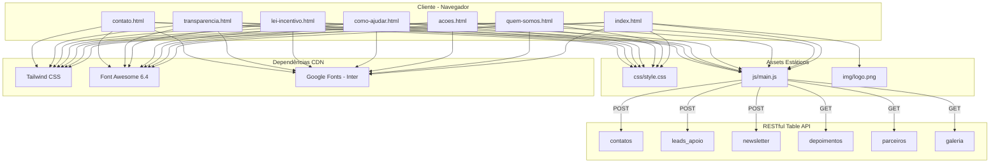

# Escopo Técnico — Correção de Conformidade do Site

**Projeto:** Instituto S.E.R. Sagi — Site Institucional  
**Versão:** 2.0  
**Data:** 19/06/2026  
**Arquiteto:** Agente ARCHITECT  
**Origem:** [`briefing.md`](briefing.md) + [`requisitos.md`](requisitos.md)

---

## 1. Arquitetura Atual

### 1.1 Diagrama do Sistema



### 1.2 Stack Tecnológica

| Camada | Tecnologia | Versão | Carregamento |
|--------|-----------|--------|-------------|
| Estrutura | HTML5 | — | Estático (7 arquivos) |
| Estilo | Tailwind CSS | CDN (latest) | [`<script>`](https://cdn.tailwindcss.com) |
| Estilo customizado | CSS3 | [`css/style.css`](../css/style.css) | [`<link>`](../css/style.css) |
| Ícones | Font Awesome | 6.4.0 | CDN |
| Tipografia | Google Fonts (Inter) | — | CDN |
| Lógica | JavaScript (vanilla) | ES6+ | [`js/main.js`](../js/main.js) |
| Backend/DB | RESTful Table API | Plataforma interna | Fetch API |

### 1.3 Estrutura de Pastas Atual

```
Site SER Sagi/
├── index.html
├── quem-somos.html
├── acoes.html
├── como-ajudar.html
├── lei-incentivo.html
├── transparencia.html
├── contato.html
├── README.md
├── css/
│   └── style.css
├── js/
│   └── main.js
├── img/
│   └── logo.png
└── docs/
    ├── briefing.md       ← Origem da análise
    ├── requisitos.md     ← Este artefato
    ├── escopo.md         ← (em construção)
    └── roadmap.md        ← (pendente)
```

---

## 2. Mapa de Alterações por Arquivo

### 2.1 [`index.html`](../index.html) — Home

| # | Alteração | Referência | Linha(s) afetada(s) | Complexidade |
|---|-----------|------------|---------------------|-------------|
| A01 | Trocar "origens locais" por "origens indígenas" | RF10 | ~66 | Baixa |
| A02 | Adicionar bloco de dados demográficos IBGE (nova seção) | RF06 | Nova seção | Média |
| A03 | Mencionar "Pituba" no escopo de atuação | RF09 | ~61, ~66 | Baixa |
| A04 | Adicionar Open Graph / Twitter Cards / Schema.org | RF14 | [`<head>`](../index.html:3-18) | Média |

**Tipo:** Edição pontual + nova seção

---

### 2.2 [`quem-somos.html`](../quem-somos.html) — Quem Somos

| # | Alteração | Referência | Linha(s) afetada(s) | Complexidade |
|---|-----------|------------|---------------------|-------------|
| B01 | **Corrigir menu**: adicionar "Lei de Incentivo" | RF01 | ~21, ~24 (desktop + mobile) | Baixa |
| B02 | **Substituir header**: logo real no lugar do ícone | RF02 | ~19 | Baixa |
| B03 | **Padronizar CTA**: "Seja Parceiro" → [`lei-incentivo.html`](../lei-incentivo.html) | RF03 | ~22 | Baixa |
| B04 | **Atualizar Missão**: texto completo do PDF | RF07 | ~36 | Baixa |
| B05 | **Atualizar Visão**: texto completo do PDF | RF07 | ~37 | Baixa |
| B06 | **Criar seção Objetivo**: novo card no grid | RF08 | ~38-39 | Baixa |
| B07 | Mencionar "Pituba" e "regiões adjacentes" | RF09 | ~32, ~36 | Baixa |
| B08 | Explicitar "origens indígenas" | RF10 | ~33 | Baixa |
| B09 | Adicionar história da criação do logo | RF11 | ~33 | Baixa |
| B10 | **Padronizar footer** | RF04 | ~43 | Média |
| B11 | Adicionar Open Graph / meta keywords / theme-color | RF14 | [`<head>`](../quem-somos.html:3-14) | Média |

**Tipo:** Múltiplas edições pontuais + novo card + substituição de footer

---

### 2.3 [`acoes.html`](../acoes.html) — Nossas Ações

| # | Alteração | Referência | Linha(s) afetada(s) | Complexidade |
|---|-----------|------------|---------------------|-------------|
| C01 | **Corrigir menu**: adicionar "Lei de Incentivo" | RF01 | ~11 (desktop + mobile) | Baixa |
| C02 | **Substituir header**: logo real no lugar do ícone | RF02 | ~11 | Baixa |
| C03 | **Padronizar CTA**: "Seja Parceiro" → [`lei-incentivo.html`](../lei-incentivo.html) | RF03 | ~11 | Baixa |
| C04 | Adicionar termo "a arte suave" ao Jiu-Jitsu | RF12 | ~14 | Baixa |
| C05 | Detalhar ações solidárias (aniversários + convivência) | RF13 | ~14 | Baixa |
| C06 | **Padronizar footer** | RF04 | ~17 | Média |
| C07 | Adicionar Open Graph / meta keywords / theme-color | RF14 | [`<head>`](../acoes.html:3-8) | Média |

**Tipo:** Múltiplas edições pontuais + substituição de header/footer

---

### 2.4 [`como-ajudar.html`](../como-ajudar.html) — Como Ajudar

| # | Alteração | Referência | Linha(s) afetada(s) | Complexidade |
|---|-----------|------------|---------------------|-------------|
| D01 | **Corrigir menu**: adicionar "Lei de Incentivo" | RF01 | ~10 (desktop + mobile) | Baixa |
| D02 | **Substituir header**: logo real no lugar do ícone | RF02 | ~10 | Baixa |
| D03 | **Padronizar CTA**: "Seja Parceiro" → [`lei-incentivo.html`](../lei-incentivo.html) | RF03 | ~10 | Baixa |
| D04 | Inserir número da lei (11.438/2006) e percentuais nas seções de parceria | RF05 | Seção de parceria | Média |
| D05 | **Padronizar footer** | RF04 | Footer da página | Média |
| D06 | Adicionar Open Graph / meta keywords / theme-color | RF14 | [`<head>`](../como-ajudar.html:3-8) | Média |

**Tipo:** Múltiplas edições pontuais + conteúdo jurídico

---

### 2.5 [`lei-incentivo.html`](../lei-incentivo.html) — Lei de Incentivo

| # | Alteração | Referência | Linha(s) afetada(s) | Complexidade |
|---|-----------|------------|---------------------|-------------|
| E01 | **Substituir header**: logo real no lugar do ícone | RF02 | ~10 | Baixa |
| E02 | Inserir número da lei: "Lei nº 11.438/2006" em destaque | RF05 | ~14 (seção "Quem pode apoiar") | Baixa |
| E03 | Inserir percentual empresas: "até 2% do IR devido" | RF05 | ~14 | Baixa |
| E04 | Inserir percentual PF: "até 6% do IR devido" (validar juridicamente) | RF05 | ~14 | Baixa |
| E05 | Adicionar tagline: "Invista, transforme e gere valor..." | RF05 | Hero (~12) ou seção final | Baixa |
| E06 | **Padronizar footer** | RF04 | ~33 | Média |
| E07 | Adicionar Open Graph / meta keywords / theme-color | RF14 | [`<head>`](../lei-incentivo.html:3-7) | Média |

**Tipo:** Conteúdo jurídico crítico + padronização visual

---

### 2.6 [`transparencia.html`](../transparencia.html) — Transparência

| # | Alteração | Referência | Linha(s) afetada(s) | Complexidade |
|---|-----------|------------|---------------------|-------------|
| F01 | **Substituir header**: logo real no lugar do ícone | RF02 | ~10 | Baixa |
| F02 | **Padronizar footer** | RF04 | Footer da página | Média |
| F03 | Adicionar Open Graph / meta keywords / theme-color | RF14 | [`<head>`](../transparencia.html:3-8) | Média |

**Tipo:** Padronização visual + SEO

---

### 2.7 [`contato.html`](../contato.html) — Contato

| # | Alteração | Referência | Linha(s) afetada(s) | Complexidade |
|---|-----------|------------|---------------------|-------------|
| G01 | **Corrigir menu**: adicionar "Lei de Incentivo" | RF01 | ~10 (desktop + mobile) | Baixa |
| G02 | **Substituir header**: logo real no lugar do ícone | RF02 | ~10 | Baixa |
| G03 | **Padronizar CTA**: "Seja Parceiro" → [`lei-incentivo.html`](../lei-incentivo.html) | RF03 | ~10 | Baixa |
| G04 | Criar seção FAQ | RF15 | Nova seção | Média |
| G05 | **Padronizar footer** | RF04 | Footer da página | Média |
| G06 | Adicionar Open Graph / meta keywords / theme-color | RF14 | [`<head>`](../contato.html:3-8) | Média |

**Tipo:** Múltiplas edições + nova seção FAQ

---

## 3. Componentes Reutilizáveis (Padrões de Código)

### 3.1 Header Padrão (a ser aplicado em 6 páginas)

```html
<header class="sticky top-0 z-50 border-b border-slate-200/70 bg-white/90 backdrop-blur">
  <div class="mx-auto flex max-w-7xl items-center justify-between px-4 py-4 lg:px-8">
    <a href="index.html" class="flex items-center" aria-label="Instituto S.E.R. Sagi - página inicial">
      
    </a>
    <button id="menu-toggle" class="inline-flex items-center rounded-lg border border-slate-300 px-3 py-2 text-ocean lg:hidden" aria-expanded="false" aria-controls="mobile-menu" aria-label="Abrir menu">
      <i class="fa-solid fa-bars"></i>
    </button>
    <nav class="hidden items-center gap-6 lg:flex" aria-label="Menu principal">
      <a href="index.html" data-page-link class="text-sm font-medium hover:text-ocean">Início</a>
      <a href="quem-somos.html" data-page-link class="text-sm font-medium hover:text-ocean">Quem Somos</a>
      <a href="acoes.html" data-page-link class="text-sm font-medium hover:text-ocean">Nossas Ações</a>
      <a href="como-ajudar.html" data-page-link class="text-sm font-medium hover:text-ocean">Como Ajudar</a>
      <a href="lei-incentivo.html" data-page-link class="text-sm font-medium hover:text-ocean">Lei de Incentivo</a>
      <a href="transparencia.html" data-page-link class="text-sm font-medium hover:text-ocean">Transparência</a>
      <a href="contato.html" data-page-link class="text-sm font-medium hover:text-ocean">Contato</a>
    </nav>
    <div class="hidden items-center gap-3 lg:flex">
      <a href="lei-incentivo.html" class="cta-lift rounded-full border border-ocean px-4 py-2 text-sm font-semibold text-ocean transition hover:bg-ocean hover:text-white">Seja Parceiro</a>
      <a href="como-ajudar.html#doacao" class="cta-lift rounded-full bg-sun px-4 py-2 text-sm font-semibold text-oceanDeep transition hover:brightness-95">Doe Agora</a>
    </div>
  </div>
  <div id="mobile-menu" class="hidden border-t border-slate-200 bg-white lg:hidden">
    <nav class="mx-auto flex max-w-7xl flex-col px-4 py-4" aria-label="Menu mobile">
      <a href="index.html" data-page-link class="py-2 text-sm font-medium">Início</a>
      <a href="quem-somos.html" data-page-link class="py-2 text-sm font-medium">Quem Somos</a>
      <a href="acoes.html" data-page-link class="py-2 text-sm font-medium">Nossas Ações</a>
      <a href="como-ajudar.html" data-page-link class="py-2 text-sm font-medium">Como Ajudar</a>
      <a href="lei-incentivo.html" data-page-link class="py-2 text-sm font-medium">Lei de Incentivo</a>
      <a href="transparencia.html" data-page-link class="py-2 text-sm font-medium">Transparência</a>
      <a href="contato.html" data-page-link class="py-2 text-sm font-medium">Contato</a>
    </nav>
  </div>
</header>
```

> **Nota para CODE:** A página [`lei-incentivo.html`](../lei-incentivo.html) usa CTA contextual `#formulario-incentivo` — esta exceção deve ser mantida apenas nela.

### 3.2 Footer Padrão (a ser aplicado em 6 páginas)

```html
<footer class="bg-slate-950 text-white">
  <div class="mx-auto max-w-7xl px-4 py-12 lg:px-8">
    <div class="grid gap-8 md:grid-cols-3">
      <div>
        <h3 class="text-lg font-bold">Instituto S.E.R. Sagi</h3>
        <p class="mt-3 text-sm leading-7 text-white/75">
          Sabedoria, Esforço e Resultado.<br>
          Transformando vidas em Praia do Sagi,<br>
          Baía Formosa/RN e regiões adjacentes.
        </p>
      </div>
      <div>
        <h3 class="text-lg font-bold">Contato</h3>
        <ul class="mt-3 space-y-2 text-sm text-white/75">
          <li><i class="fa-solid fa-location-dot mr-2"></i> Praia do Sagi, Baía Formosa/RN</li>
          <li><i class="fa-solid fa-envelope mr-2"></i> contato@institutosersagi.org.br</li>
          <li><i class="fa-solid fa-phone mr-2"></i> (84) 9XXXX-XXXX</li>
        </ul>
      </div>
      <div>
        <h3 class="text-lg font-bold">Links</h3>
        <ul class="mt-3 space-y-2 text-sm">
          <li><a href="contato.html" class="text-white/75 hover:text-sun">Fale com a equipe</a></li>
          <li><a href="transparencia.html" class="text-white/75 hover:text-sun">Transparência</a></li>
          <li><a href="lei-incentivo.html" class="text-white/75 hover:text-sun">Lei de Incentivo</a></li>
        </ul>
      </div>
    </div>
    <div class="mt-8 border-t border-white/10 pt-6 text-center text-xs text-white/50">
      &copy; 2026 Instituto S.E.R. Sagi. Todos os direitos reservados.
    </div>
  </div>
</footer>
```

### 3.3 Bloco SEO Padrão (a ser adicionado em 6 páginas)

```html
<!-- Open Graph / Facebook -->
<meta property="og:type" content="website" />
<meta property="og:title" content="[TÍTULO_DA_PÁGINA]" />
<meta property="og:description" content="[DESCRIÇÃO_ESPECÍFICA]" />
<meta property="og:image" content="https://[DOMINIO]/img/og-image.png" />
<meta property="og:url" content="https://[DOMINIO]/[pagina].html" />
<meta property="og:site_name" content="Instituto S.E.R. Sagi" />
<meta property="og:locale" content="pt_BR" />

<!-- Twitter Card -->
<meta name="twitter:card" content="summary_large_image" />
<meta name="twitter:title" content="[TÍTULO_DA_PÁGINA]" />
<meta name="twitter:description" content="[DESCRIÇÃO_ESPECÍFICA]" />
<meta name="twitter:image" content="https://[DOMINIO]/img/og-image.png" />

<!-- Meta extras -->
<meta name="keywords" content="[KEYWORDS_ESPECÍFICAS]" />
<meta name="theme-color" content="#0f5c73" />
```

E para [`index.html`](../index.html), adicionar Schema.org:

```html
<script type="application/ld+json">
{
  "@context": "https://schema.org",
  "@type": "NGO",
  "name": "Instituto S.E.R. Sagi",
  "description": "Organização social que promove desenvolvimento humano por meio de saúde, esporte, educação, cultura e preservação ambiental em Praia do Sagi, Baía Formosa/RN.",
  "url": "https://[DOMINIO]/",
  "logo": "https://[DOMINIO]/img/logo.png",
  "address": {
    "@type": "PostalAddress",
    "addressLocality": "Baía Formosa",
    "addressRegion": "RN",
    "addressCountry": "BR"
  },
  "knowsAbout": ["Saúde", "Esporte", "Educação", "Cultura", "Preservação Ambiental", "Lei de Incentivo ao Esporte"]
}
</script>
```

---

## 4. Tabela-Resumo de Todas as Alterações

| ID | Página | Alteração | Prioridade | Tipo |
|----|--------|-----------|------------|------|
| A01 | [`index.html`](../index.html) | "origens locais" → "origens indígenas" | 🟢 REC | Texto |
| A02 | [`index.html`](../index.html) | Nova seção: dados IBGE | 🟡 IMP | HTML novo |
| A03 | [`index.html`](../index.html) | Mencionar Pituba | 🟡 IMP | Texto |
| A04 | [`index.html`](../index.html) | OG + Twitter + Schema.org | 🟢 REC | Meta tags |
| B01 | [`quem-somos.html`](../quem-somos.html) | Menu: + Lei de Incentivo | 🔴 CRI | HTML |
| B02 | [`quem-somos.html`](../quem-somos.html) | Header: logo real | 🟡 IMP | HTML |
| B03 | [`quem-somos.html`](../quem-somos.html) | CTA: → lei-incentivo.html | 🟡 IMP | HTML |
| B04 | [`quem-somos.html`](../quem-somos.html) | Missão: texto completo | 🟡 IMP | Texto |
| B05 | [`quem-somos.html`](../quem-somos.html) | Visão: texto completo | 🟡 IMP | Texto |
| B06 | [`quem-somos.html`](../quem-somos.html) | Novo card: Objetivo | 🟡 IMP | HTML novo |
| B07 | [`quem-somos.html`](../quem-somos.html) | Mencionar Pituba | 🟡 IMP | Texto |
| B08 | [`quem-somos.html`](../quem-somos.html) | "origens indígenas" explícito | 🟢 REC | Texto |
| B09 | [`quem-somos.html`](../quem-somos.html) | História do logo | 🟢 REC | Texto |
| B10 | [`quem-somos.html`](../quem-somos.html) | Footer padrão | 🟢 REC | HTML |
| B11 | [`quem-somos.html`](../quem-somos.html) | OG + keywords + theme-color | 🟢 REC | Meta tags |
| C01 | [`acoes.html`](../acoes.html) | Menu: + Lei de Incentivo | 🔴 CRI | HTML |
| C02 | [`acoes.html`](../acoes.html) | Header: logo real | 🟡 IMP | HTML |
| C03 | [`acoes.html`](../acoes.html) | CTA: → lei-incentivo.html | 🟡 IMP | HTML |
| C04 | [`acoes.html`](../acoes.html) | "a arte suave" no Jiu-Jitsu | 🟢 REC | Texto |
| C05 | [`acoes.html`](../acoes.html) | Detalhar ações solidárias | 🟢 REC | Texto |
| C06 | [`acoes.html`](../acoes.html) | Footer padrão | 🟢 REC | HTML |
| C07 | [`acoes.html`](../acoes.html) | OG + keywords + theme-color | 🟢 REC | Meta tags |
| D01 | [`como-ajudar.html`](../como-ajudar.html) | Menu: + Lei de Incentivo | 🔴 CRI | HTML |
| D02 | [`como-ajudar.html`](../como-ajudar.html) | Header: logo real | 🟡 IMP | HTML |
| D03 | [`como-ajudar.html`](../como-ajudar.html) | CTA: → lei-incentivo.html | 🟡 IMP | HTML |
| D04 | [`como-ajudar.html`](../como-ajudar.html) | Lei 11.438 + percentuais | 🔴 CRI | HTML + Texto |
| D05 | [`como-ajudar.html`](../como-ajudar.html) | Footer padrão | 🟢 REC | HTML |
| D06 | [`como-ajudar.html`](../como-ajudar.html) | OG + keywords + theme-color | 🟢 REC | Meta tags |
| E01 | [`lei-incentivo.html`](../lei-incentivo.html) | Header: logo real | 🟡 IMP | HTML |
| E02 | [`lei-incentivo.html`](../lei-incentivo.html) | Nº da lei: 11.438/2006 | 🔴 CRI | Texto |
| E03 | [`lei-incentivo.html`](../lei-incentivo.html) | % empresas: até 2% | 🔴 CRI | Texto |
| E04 | [`lei-incentivo.html`](../lei-incentivo.html) | % PF: até 6% (validar) | 🔴 CRI | Texto |
| E05 | [`lei-incentivo.html`](../lei-incentivo.html) | Tagline do PDF | 🟢 REC | Texto |
| E06 | [`lei-incentivo.html`](../lei-incentivo.html) | Footer padrão | 🟢 REC | HTML |
| E07 | [`lei-incentivo.html`](../lei-incentivo.html) | OG + keywords + theme-color | 🟢 REC | Meta tags |
| F01 | [`transparencia.html`](../transparencia.html) | Header: logo real | 🟡 IMP | HTML |
| F02 | [`transparencia.html`](../transparencia.html) | Footer padrão | 🟢 REC | HTML |
| F03 | [`transparencia.html`](../transparencia.html) | OG + keywords + theme-color | 🟢 REC | Meta tags |
| G01 | [`contato.html`](../contato.html) | Menu: + Lei de Incentivo | 🔴 CRI | HTML |
| G02 | [`contato.html`](../contato.html) | Header: logo real | 🟡 IMP | HTML |
| G03 | [`contato.html`](../contato.html) | CTA: → lei-incentivo.html | 🟡 IMP | HTML |
| G04 | [`contato.html`](../contato.html) | Nova seção: FAQ | 🟢 REC | HTML novo |
| G05 | [`contato.html`](../contato.html) | Footer padrão | 🟢 REC | HTML |
| G06 | [`contato.html`](../contato.html) | OG + keywords + theme-color | 🟢 REC | Meta tags |

**Total:** 44 alterações pontuais em 7 arquivos

---

## 5. Restrições Técnicas

### 5.1 O que NÃO deve ser alterado

- ❌ Estrutura de pastas (`css/`, `js/`, `img/`, `docs/`)
- ❌ [`js/main.js`](../js/main.js) — funcionalidades de menu, formulários e API permanecem intactas
- ❌ [`css/style.css`](../css/style.css) — classes e variáveis CSS preservadas (podem receber adições se necessário)
- ❌ [`img/logo.png`](../img/logo.png) — arquivo binário não será modificado
- ❌ Tailwind CSS config inline — paleta de cores e tema preservados
- ❌ Endpoints da RESTful Table API — permanecem inalterados

### 5.2 O que PODE ser adicionado

- ✅ Novos blocos HTML em páginas existentes (seções, cards, listas)
- ✅ Novos textos e parágrafos (conteúdo estático)
- ✅ Novas meta tags no `<head>`
- ✅ Novas classes utilitárias Tailwind (já disponíveis via CDN)
- ✅ Um arquivo de imagem para Open Graph (opcional, se desejado: `img/og-image.png`)

### 5.3 Dependências

- Nenhuma nova dependência externa
- Nenhum build step, bundler ou transpilador
- Nenhum pacote npm
- Nenhuma alteração no backend/API

---

## 6. Estrutura de Pastas Pós-Implementação

```
Site SER Sagi/
├── index.html                  ← Editado (A01-A04)
├── quem-somos.html             ← Editado (B01-B11)
├── acoes.html                  ← Editado (C01-C07)
├── como-ajudar.html            ← Editado (D01-D06)
├── lei-incentivo.html          ← Editado (E01-E07)
├── transparencia.html          ← Editado (F01-F03)
├── contato.html                ← Editado (G01-G06)
├── README.md                   ← (inalterado nesta etapa)
├── css/
│   └── style.css               ← (inalterado)
├── js/
│   └── main.js                 ← (inalterado)
├── img/
│   └── logo.png                ← (inalterado)
│   └── og-image.png            ← (novo, opcional)
├── docs/
│   ├── briefing.md             ← (origem da análise)
│   ├── requisitos.md           ← (artefato ARCHITECT)
│   ├── escopo.md               ← (artefato ARCHITECT)
│   └── roadmap.md              ← (artefato ARCHITECT, pendente)
└── plans/
    └── plan.md                 ← (a ser gerado pelo ORCHESTRATOR)
```

---

## 7. Handoff para ORCHESTRATOR

Este documento de escopo fornece:

1. **Arquitetura atual** mapeada (diagrama + stack + estrutura de pastas)
2. **Mapa completo de alterações** por arquivo (44 alterações em 7 arquivos)
3. **Componentes reutilizáveis** com código de referência para header, footer e SEO
4. **Restrições técnicas** claras (o que pode e não pode ser alterado)
5. **Estrutura final esperada** das pastas

**Próximo passo:** Combinar com [`requisitos.md`](requisitos.md) e [`roadmap.md`](roadmap.md) para o ORCHESTRATOR gerar o plano de tasks para o CODE.
