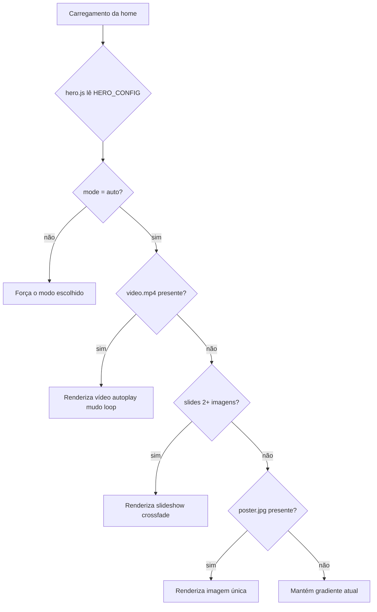
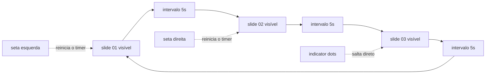
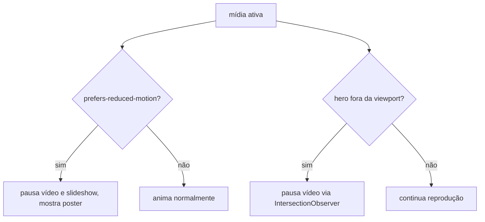

# Spec — Hero Grande de Mídia (Vídeo / Fotos / Slides)

**Projeto:** Instituto S.E.R. Sagi — Site Institucional
**Versão:** 3.0 (evolução do hero)
**Data:** 25/08/2026
**Arquiteto:** Agente ARCHITECT
**Solicitante:** Bimbord (SEO chefe)
**Origem:** [`docs/hero.md`](hero.md) (spec anterior de vídeo) + [`docs/escopo.md`](escopo.md) + [`docs/roadmap.md`](roadmap.md)

> Contexto: a home usa hoje um hero em gradiente estático em [`index.html`](../index.html:35-63). O pedido é evoluí-lo para um **hero "grande"** (full-viewport, imersivo) que aceite **vídeo, fotos ou slides** — com a possibilidade de alternar entre os modos sem reescrever a estrutura.

---

## 1. Objetivo

Transformar o hero da home em um **componente único de mídia adaptativa** que degrade graciosamente entre 4 modos, na ordem de prioridade:

| Prioridade | Modo | Quando entra em cena |
|---|---|---|
| 1 | **Vídeo de fundo** | existe `img/hero-video.mp4` |
| 2 | **Slideshow de fotos** | existe 2+ imagens em `img/hero-slides/` |
| 3 | **Imagem única (poster)** | existe `img/hero-poster.jpg` |
| 4 | **Gradiente atual** | nenhum asset entregue (estado de hoje) |

**Impacto desejado:** hero grande e emocional no topo da home — crianças reais em atividade — mantendo a vitrine da causa para parceiros, doadores e fiscalizadores.

---

## 2. Decisão de Arquitetura

### 2.1 Princípio central

Um **único bloco de marcação** com **camadas sobrepostas** e um **resolvedor de mídia** pequeno que decide, em tempo de execução, qual camada de fundo exibir. Nada do conteúdo institucional atual é removido ou reescrito.

```
┌─────────────────────────────────────────────────────┐
│  SECTION hero  (relative, overflow-hidden, min-h)   │
│                                                     │
│  ┌─ CAMADA 1 · MÍDIA (absolute inset-0, z-0) ───┐   │
│  │  [resolvedor escolhe UMA destas]              │   │
│  │   a) <video autoplay muted loop playsinline>  │   │
│  │   b) <ul> slides com  (crossfade)        │   │
│  │   c)  poster único                       │   │
│  │   d) gradiente atual (fallback)               │   │
│  └───────────────────────────────────────────────┘   │
│  ┌─ CAMADA 2 · OVERLAY (absolute inset-0, z-1) ──┐   │
│  │  gradiente escuro + glow-orbs (manter os 3)   │   │
│  └───────────────────────────────────────────────┘   │
│  ┌─ CAMADA 3 · CONTEÚDO (z-10) ──────────────────┐   │
│  │  badge, título S.E.R., texto, CTAs, métricas, │   │
│  │  card "Todos somos Sagi" (TUDO preservado)    │   │
│  └───────────────────────────────────────────────┘   │
└─────────────────────────────────────────────────────┘
```

### 2.2 Por que componente único e não três páginas

- **Manutenção:** o conteúdo institucional vive em um único lugar; trocar de mídia não toca no texto.
- **Simplicidade:** quem alimenta o site só troca arquivos em `img/` ou edita 1 linha de config.
- **Performance:** só carrega a mídia do modo ativo (não baixa vídeo E slides juntos).
- **Escalabilidade:** adicionar um 5º modo (ex.: vídeo do YouTube) no futuro não muda a estrutura.

---

## 3. Anatomia do Componente (referência de marcação)

### 3.0 Referência visual aprovada

A imagem enviada pelo SEO (hero do site Instituto Neymar Jr.) define o **padrão visual** do novo hero. Características a replicar:

| Elemento da referência | Como aplicar no S.E.R. Sagi |
|---|---|
| Hero em **tela cheia** (primeira dobra inteira) | `min-h-screen` (100vh) no desktop; altura flexível no mobile |
| **Mídia de fundo** cobrindo 100% | camada `#hero-media` com `object-cover` (vídeo ou slides) |
| **Overlay escuro** para legibilidade | gradiente `from-oceanDeep/85 via-ocean/60 to-leaf/50` |
| **Título grande** com palavra-chave em **cor de destaque** | manter o dourado `#e0c960` já usado em "S.E.R."; destacar também a palavra **"Resultado"** em `sun` |
| **Bloco de patrocinadores/parceiros** no canto | adicionar selo "Quem confia" com logos na base ou lateral do hero |
| Texto de apoio + CTAs sobre a mídia | conteúdo atual preservado, com `z-10` |

> A referência usa uma foto aérea do complexo como fundo — no S.E.R. Sagi, o equivalente ideal é o vídeo institucional ou uma foto real das atividades (crianças em jiu-jitsu, consultório, praia do Sagi).

### 3.1 Bloco do hero (substitui a `<section>` da linha 35 de [`index.html`](../index.html:35))

```html
<section id="hero" class="hero-pattern premium-outline relative flex min-h-screen flex-col overflow-hidden bg-gradient-to-br from-oceanDeep via-ocean to-leaf text-white">
  <!-- CAMADA 1 · MÍDIA (renderizada pelo js/hero.js) -->
  <div id="hero-media" class="absolute inset-0 z-0" aria-hidden="true"></div>

  <!-- CAMADA 2 · OVERLAY -->
  <div class="absolute inset-0 z-[1] bg-gradient-to-br from-oceanDeep/85 via-ocean/60 to-leaf/50"></div>
  <div class="glow-orb left-[-60px] top-10 h-56 w-56 bg-white/30 z-[1]"></div>
  <div class="glow-orb right-[-40px] top-16 h-64 w-64 bg-sun/40 z-[1]"></div>
  <div class="glow-orb bottom-0 left-1/3 h-52 w-52 bg-coral/30 z-[1]"></div>

  <!-- CAMADA 3 · CONTEÚDO (grid cresce para ocupar a dobra) -->
  <div class="relative z-10 mx-auto grid w-full max-w-7xl flex-1 content-center gap-12 px-4 py-16 lg:grid-cols-[1.08fr_0.92fr] lg:px-8 lg:py-20">
    <!-- coluna esquerda: badge, título S.E.R. (grande), parágrafo, CTAs, métricas -->
    <!-- coluna direita: aside "Todos somos Sagi" (fundo branco, legível) -->
  </div>

  <!-- CAMADA 4 · PARCEIROS (faixa inferior, inspirada no bloco de patrocinadores da referência) -->
  <div class="relative z-10 mx-auto w-full max-w-7xl px-4 pb-8 lg:px-8">
    <!-- selo "Quem confia" + logos de parceiros (opcional, reutiliza dados de js/main.js renderPartners) -->
  </div>
</section>
```

> Regra: a coluna da esquerda (texto) e o `aside` "Todos somos Sagi" permanecem **exatamente** como estão em [`index.html`](../index.html:40-61) — apenas recebem ajuste de escala tipográfica para o formato grande. O `aside` branco continua legível sobre qualquer mídia. A faixa de parceiros é **adicional e opcional** (não remove conteúdo existente).

### 3.2 Modos de mídia (o que o `js/hero.js` injeta dentro de `#hero-media`)

**Modo 1 — Vídeo:**

```html
<video autoplay muted loop playsinline preload="metadata" poster="img/hero-poster.jpg"
       class="h-full w-full object-cover" tabindex="-1" aria-hidden="true">
  <source src="img/hero-video.mp4" type="video/mp4">
  <source src="img/hero-video.webm" type="video/webm">
</video>
```

**Modo 2 — Slideshow:**

```html
<ul class="hero-slides relative h-full w-full overflow-hidden">
  <li class="hero-slide active"></li>
  <li class="hero-slide"></li>
  <!-- demais slides -->
</ul>
<div class="hero-slide-controls absolute bottom-6 right-6 z-20 flex gap-2" role="group" aria-label="Controles do carrossel">
  <!-- setas anterior/próximo + indicadores -->
</div>
```

**Modo 3 — Imagem única:**

```html

```

**Modo 4 — Gradiente:** `#hero-media` permanece vazio; o gradiente da `<section>` já cumpre o papel.

### 3.3 Config declarativa (topo do `js/hero.js`)

O resolvedor usa uma config simples, editável por uma pessoa não técnica:

```js
const HERO_CONFIG = {
  mode: 'auto',            // 'auto' | 'video' | 'slides' | 'image' | 'none'
  video: 'img/hero-video.mp4',
  poster: 'img/hero-poster.jpg',
  slides: [
    'img/hero-slides/slide-01.jpg',
    'img/hero-slides/slide-02.jpg',
    'img/hero-slides/slide-03.jpg'
  ],
  slideInterval: 5000      // ms entre transições
};
```

- `mode: 'auto'` → resolve na ordem vídeo → slides → imagem → gradiente.
- `mode: 'slides'` → força slideshow mesmo com vídeo presente (útil para A/B test).

---

## 4. Especificação dos Assets (performance 3G/4G)

| Asset | Formato | Dimensão | Peso máx. | Observação |
|---|---|---|---|---|
| `hero-video.mp4` | H.264 (AVC), MP4 | 1280×720 (720p) | 2–5 MB | 15–25 s, SEM som |
| `hero-video.webm` | VP9, WebM | 1280×720 | ~1,5–3 MB | opcional, fallback Safari/iOS |
| `hero-poster.jpg` | JPEG/WebP | 1280×720 | ~150 KB | capa do vídeo + fallback de imagem |
| `hero-slides/slide-0N.jpg` | JPEG/WebP | 1920×1080 | 200–400 KB cada | 3–5 slides |

**Regras de ouro:**
- Vídeo **mudo** (autoplay com som é bloqueado pelos navegadores).
- `playsinline` é **obrigatório** para iOS.
- Autorização de imagem das crianças é **pré-requisito legal** (LGPD/direito de imagem) — ver [`docs/estrategia-tecnica.md`](estrategia-tecnica.md) seção 5.
- Enquanto os assets reais não chegam, o componente degrada para o gradiente atual — **zero erro visual**.

---

## 5. Estrutura de Pastas Pós-Implementação

```
Site SER Sagi/
├── index.html                    ← Editado (seção hero + <script src="js/hero.js">)
├── quem-somos.html               ← inalterado nesta tarefa
├── acoes.html                    ← inalterado nesta tarefa
├── como-ajudar.html              ← inalterado nesta tarefa
├── lei-incentivo.html            ← inalterado nesta tarefa
├── transparencia.html            ← inalterado nesta tarefa
├── contato.html                  ← inalterado nesta tarefa
├── css/
│   └── style.css                 ← ADIÇÕES no final (animação do slideshow)
├── js/
│   ├── main.js                   ← NÃO tocar (regra de fidelidade)
│   └── hero.js                   ← NOVO (resolvedor + slideshow, só na home)
├── img/
│   ├── logo.png                  ← NÃO tocar
│   ├── hero-video.mp4            ← NOVO (cliente)
│   ├── hero-video.webm           ← NOVO (opcional)
│   ├── hero-poster.jpg           ← NOVO (cliente)
│   └── hero-slides/
│       ├── slide-01.jpg          ← NOVO (cliente)
│       ├── slide-02.jpg          ← NOVO (cliente)
│       └── slide-03.jpg          ← NOVO (cliente)
├── docs/
│   ├── hero.md                   ← spec anterior (contexto)
│   ├── hero-midia.md             ← ESTA spec
│   └── ...
└── plans/
    └── plan.md                   ← a ser atualizado pelo ORCHESTRATOR
```

> A adição de `js/hero.js` e de linhas no final de [`css/style.css`](../css/style.css) é **nova autorização** desta spec. O arquivo [`js/main.js`](../js/main.js) permanece intocável (regra do [`plans/plan.md`](../plans/plan.md:19)).

---

## 6. Fluxos do Sistema

### 6.1 Resolução do modo de mídia



### 6.2 Ciclo de vida do slideshow



### 6.3 Comportamento de acessibilidade e performance



---

## 7. Acessibilidade, Performance e SEO

| Pilar | Medida |
|---|---|
| **Acessibilidade** | vídeo com `aria-hidden="true"` + `tabindex="-1"`; controles do slideshow com `role="group"` + `aria-label`; respeito a `prefers-reduced-motion` |
| **Performance** | só o modo ativo carrega mídia; `preload="metadata"` no vídeo; slides 2+ com `loading="lazy"`; overlay via CSS (sem imagem extra) |
| **SEO** | conteúdo real (título, texto, CTAs, métricas) permanece no HTML estático; mídia decorativa fica fora do fluxo de leitura; fotos do slideshow podem receber `alt` descritivo na primeira e vazio nas demais |
| **Legibilidade** | overlay escuro garante contraste AA para texto branco sobre qualquer foto/vídeo |

> Recomendação de SEO a validar com o solicitante: hoje o título principal do hero é um `<h2>` em [`index.html`](../index.html:43) e não há `<h1>` na página. Para o novo hero grande, avaliar transformar o título S.E.R. em `<h1>` único da home.

---

## 8. Restrições e Regras de Fidelidade (para o CODE)

### 8.1 NÃO fazer

- ❌ NÃO tocar em [`js/main.js`](../js/main.js), [`img/logo.png`](../img/logo.png) nem nas regras já existentes de [`css/style.css`](../css/style.css)
- ❌ NÃO remover/reescrever badge, título S.E.R., parágrafo, CTAs, métricas ou card "Todos somos Sagi"
- ❌ NÃO mudar cores, fontes ou classes já usadas no hero
- ❌ NÃO colocar som no vídeo
- ❌ NÃO esquecer `playsinline` no `<video>`
- ❌ NÃO usar vídeo/foto de terceiros em produção sem avisar o humano (placeholder externo só para teste visual, com comentário `<!-- PLACEHOLDER: remover -->`)

### 8.2 PODE fazer

- ✅ Editar [`index.html`](../index.html) (apenas a seção hero e o `<script>` do hero no fim do body)
- ✅ Criar [`js/hero.js`](../js/hero.js) (arquivo novo)
- ✅ **Adicionar** regras CSS **no final** de [`css/style.css`](../css/style.css), sem alterar as existentes (animação `hero-slide` e suporte a `prefers-reduced-motion`)
- ✅ Usar classes utilitárias Tailwind (CDN já disponível)

---

## 9. Roadmap de Desenvolvimento (tasks para o CODE)

> Sem estimativa de esforço — foco em entregas atômicas e validáveis, na ordem abaixo.

### Wave 1 — Base do componente (independente dos assets reais)

| Task | Descrição | Arquivo(s) | Critério de validação |
|---|---|---|---|
| H1 | Inserir `#hero-media` e a camada de overlay/gradient na seção hero, preservando o conteúdo atual | [`index.html`](../index.html:35-63) | Home abre idêntica ao estado atual (gradiente), sem erro de JS |
| H2 | Criar [`js/hero.js`](../js/hero.js) com `HERO_CONFIG`, resolvedor de modo e renderização dos 4 modos | [`js/hero.js`](../js/hero.js) (novo) | Config `mode:'none'` mantém gradiente; `mode:'image'` renderiza poster se existir |
| H3 | Adicionar animação de crossfade dos slides + `prefers-reduced-motion` no final do CSS | [`css/style.css`](../css/style.css) | Transição suave entre slides; sem animação quando o SO pede redução de movimento |
| H4 | Adicionar `<script src="js/hero.js"></script>` antes de `</body>` na home | [`index.html`](../index.html:124) | Script carrega sem conflito com `main.js` |

**Checkpoint:** componente funcionando em modo `auto`; na ausência de assets, a home fica idêntica ao estado atual.

### Wave 2 — Slideshow funcional

| Task | Descrição | Arquivo(s) | Critério de validação |
|---|---|---|---|
| H5 | Implementar troca automática de slides (timer) + pausa no hover | [`js/hero.js`](../js/hero.js) | Slides alternam a cada `slideInterval`; pausa ao passar o mouse |
| H6 | Implementar setas anterior/próximo e indicadores (dots) com reset de timer | [`js/hero.js`](../js/hero.js) | Navegação manual funciona e reinicia o autoplay |
| H7 | Implementar `IntersectionObserver` para pausar o vídeo quando o hero sair da tela | [`js/hero.js`](../js/hero.js) | Vídeo pausa fora da viewport e retoma ao voltar |

**Checkpoint:** slideshow 100% funcional com 3 slides de teste (placeholders).

### Wave 3 — Ajustes visuais e refinamento (referência visual aprovada)

| Task | Descrição | Arquivo(s) | Critério de validação |
|---|---|---|---|
| H8 | Ajustar altura do hero para **tela cheia**: `min-h-screen` no desktop (100vh) com `flex flex-col` + `content-center`; altura flexível no mobile (mínimo para não cortar CTAs) | [`index.html`](../index.html:35) | Hero ocupa toda a primeira dobra no desktop, sem cortar CTAs no mobile |
| H9 | Refinar overlay para legibilidade sobre fotos claras/escuras (`from-oceanDeep/85 via-ocean/60 to-leaf/50`) e ajustar glow-orbs | [`index.html`](../index.html) | Contraste AA do texto sobre qualquer imagem |
| H10 | Aplicar escala tipográfica ao título S.E.R. (formato grande) mantendo o dourado `#e0c960` e destacando a palavra "Resultado" em `sun` | [`index.html`](../index.html:43-51) | Título grande e legível, destaque coerente com a referência |
| H11 | Adicionar faixa inferior "Quem confia" com logos de parceiros, reutilizando o mesmo padrão visual da seção Parceiros existente | [`index.html`](../index.html:99-119) | Selo de parceiros visível na base do hero; conteúdo existente preservado |

**Checkpoint:** hero "grande" aprovado visualmente, responsivo e com mídia de fundo.

---

## 10. Handoff para ORCHESTRATOR

Este documento entrega ao ORCHESTRATOR:

1. **Decisão de arquitetura** — componente único com 4 modos e fallback em cadeia (seção 2)
2. **Marcação e config de referência** — snippets prontos para o CODE (seção 3)
3. **Spec de assets** com dimensões e pesos máximos para o cliente (seção 4)
4. **Estrutura de pastas pós-implementação** (seção 5)
5. **Fluxos do sistema em Mermaid** (seção 6)
6. **Restrições e regras de fidelidade** claras para o CODE (seção 8)
7. **Roadmap em 3 ondas com critérios de validação por task** (seção 9)

**Próximos passos do ORCHESTRATOR:**
- Gerar/atualizar [`plans/plan.md`](../plans/plan.md) com as tasks H1–H11 na ordem da seção 9
- Coordenar o CODE respeitando a ordem: base → slideshow → refinamento visual (Wave 3 já com a referência visual aprovada)
- Liberar a Wave 3 sem pendências — a imagem de referência já foi analisada e incorporada na seção 3.0 e seção 12

---

## 11. Pendências para o Cliente / SEO

- [x] **Imagem de referência** do site modelo — recebida e incorporada na seção 3.0
- [ ] Vídeo institucional real (crianças em atividade, autorização de imagem dos responsáveis)
- [ ] 3–5 fotos oficiais para os slides (com autorização de uso de imagem)
- [ ] Poster (frame bonito do vídeo ou foto real)
- [ ] Definir se o hero de mídia fica **só na home** (recomendado — performance) ou se expande para páginas internas
- [ ] Validar com SEO se o título principal do hero vira `<h1>` único da home

---

## 12. Decisões de design — resultado da imagem de referência

A imagem enviada (hero do Instituto Neymar Jr.) foi analisada e resultou nas seguintes decisões **fechadas** (a arquitetura das ondas 1 e 2 permanece inalterada):

| # | Ponto avaliado | Decisão adotada |
|---|---|---|
| 1 | Altura e responsividade | Hero em **tela cheia** (`min-h-screen` desktop, flexível mobile) — task H8 |
| 2 | Posição da mídia | **Fundo completo** (`object-cover`), sem moldura lateral — camada `#hero-media` |
| 3 | Controles do slideshow | Setas + dots, padrão discreto, com pausa no hover — tasks H5–H7 |
| 4 | Overlay | Gradiente `from-oceanDeep/85 via-ocean/60 to-leaf/50` — task H9 |
| 5 | Tipografia | Título grande mantendo dourado `#e0c960`; "Resultado" em destaque `sun` — task H10 |
| 6 | Bloco de patrocinadores | Faixa inferior "Quem confia" com logos — task H11 (adicional, opcional) |
