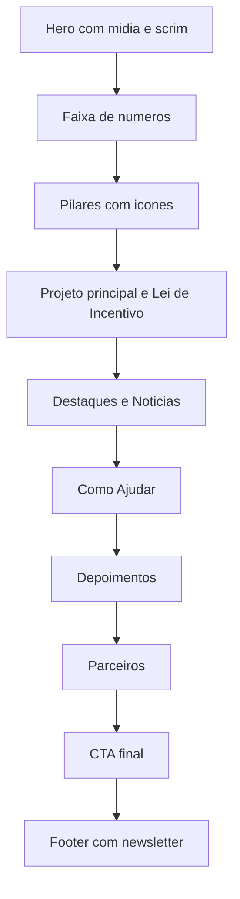

# Spec — Refactor da Home (Clean · Moderno · Hierárquico)

**Projeto:** Instituto S.E.R. Sagi — Site Institucional
**Versão:** 4.1 (refactor visual/estrutural da home)
**Data:** 01/09/2026
**Arquiteto:** Agente ARCHITECT
**Solicitante:** Bimbord (SEO chefe)
**Origem:** prompt de refactor da home (10 tarefas) + [`index.html`](../index.html:1), [`css/style.css`](../css/style.css:1), [`js/main.js`](../js/main.js:1), [`js/hero.js`](../js/hero.js:1), [`docs/pendencias.md`](pendencias.md:41)

> Escopo **único e isolado**: refatorar a página inicial (estrutura e estilo) para ficar mais clean, moderna e com melhor hierarquia visual — **sem** alterar a paleta institucional, **sem** reescrever o projeto e **sem** alterar o conteúdo textual/números.

---

## 1. Objetivo

Reorganizar e uniformizar a home em 10 tarefas, preservando:

- Paleta institucional (azul-petróleo `#0f5c73`, verde-teal `#2e7d4f`, amarelo `#f4b400`, areia `#f5efe3`).
- Todo o conteúdo textual e os números atuais.
- Acessibilidade (hierarquia `h1 → h2 → h3`, `alt` nas imagens, foco visível, contraste AA).
- Responsividade mobile-first (360px, 768px, 1024px, 1440px).

---

## 2. Escopo e Arquivos Afetados

| Arquivo | Papel neste refactor | Tipo de alteração |
|---|---|---|
| [`index.html`](../index.html:1) | Reestruturar seções, hero, faixa de números, pilares, cards, footer e newsletter | Edição (somente home) |
| [`css/style.css`](../css/style.css:1) | Adicionar tokens em `:root` + classes próprias prefixadas `home-`/`btn-` **no final** | Adição no final |
| [`js/main.js`](../js/main.js:202) | Ajustar templates de `renderTestimonials`, `renderPartners` e `renderHighlights` para o novo padrão de card | Edição (apenas templates) |
| [`js/hero.js`](../js/hero.js:1) | **Intocado** (resolvedor de mídia e slideshow permanecem) | Nenhuma |

**Fora do escopo (NÃO tocar):**

- Demais páginas HTML (`quem-somos.html`, `acoes.html`, `acervo*.html`, `como-ajudar.html`, `lei-incentivo.html`, `transparencia.html`, `contato.html`).
- Lógica de dados/formulários de [`js/main.js`](../js/main.js:44) (Supabase, fetch, envio).
- [`img/logo.png`](../img/logo.png) e [`img/logo2-hero.png`](../img/logo2-hero.png).
- Regras CSS existentes (apenas **adicionar** no final).

---

## 3. Decisões de Arquitetura

### 3.1 Stack e padrão mantidos

- **Tailwind Play CDN** (já carregado em [`index.html`](../index.html:14)) permanece para utilitários de layout e tipografia nas seções **estáticas**.
- **CSS próprio** continua em [`css/style.css`](../css/style.css:1); o refactor adiciona classes **somente no final** do arquivo.
- **Sem** nova biblioteca de UI, **sem** novo sistema de grid, **sem** `!important`, **sem** alterar seletores globais usados por outras páginas.
- Novos estilos específicos da home usam prefixo `home-` (escopo próprio, exigência do solicitante). Componentes reutilizáveis de botão usam prefixo `btn-`.

### 3.2 Restrição crítica do Tailwind Play CDN × conteúdo dinâmico

[`docs/pendencias.md`](pendencias.md:41) registra que **classes responsivas dentro de `innerHTML` (conteúdo injetado via JS) podem não ser estilizadas** pelo Play CDN.

**Decisão:** os templates dinâmicos ([`renderTestimonials`](../js/main.js:202), [`renderPartners`](../js/main.js:228), [`renderHighlights`](../js/main.js:334)) passam a usar **exclusivamente classes próprias** definidas no CSS (`.home-card`, `.home-quote`, `.home-partner`, `.home-highlight`…). Os **containers** que hospedam esses templates continuam no HTML estático com o grid responsivo Tailwind — processado normalmente pelo CDN.

### 3.3 Preservação do hero de mídia

O hero continua sendo um componente de mídia adaptativa renderizado por [`js/hero.js`](../js/hero.js:156): camadas `#hero-media` (z-0), overlay (z-1), glow-orbs, logotipo sobreposto [`img/logo2-hero.png`](../index.html:43) e `#hero-controls` (z-20) **não são removidos**.

O que muda no hero (Tarefa 2) é **apenas**: overlay → scrim diagonal, tipografia em dois níveis, localização → pill translúcida, parágrafo limitado a ~2 linhas, botões padronizados e **remoção das métricas** (vão para a faixa única da Tarefa 3).

### 3.4 Números da faixa única — ✅ CONFIRMADO PELO SEO

Consolidar em **uma faixa única com os 6 números atuais** (decisão do SEO em 01/09/2026):

| # | Rótulo | Valor | Descrição |
|---|---|---|---|
| 1 | Projeto principal | **120** | crianças na Jóia da Coroa |
| 2 | Saúde | **1.149+** | procedimentos odontológicos realizados |
| 3 | Consultório | **194** | pacientes atendidos |
| 4 | Esporte | **230+** | crianças em Sagi e Pituba |
| 5 | Jiu-jitsu | **49** | alunos atendidos |
| 6 | Musculação | **118** | inscritos no estúdio |

> Os números `49` (jiu-jitsu) e `118` (musculação) permanecem na home, agora dentro da faixa única — **não** saem mais para páginas internas.

### 3.5 Hierarquia de botões

Três variações reutilizáveis, todas sobre uma base `.btn`:

| Classe | Uso | Estilo |
|---|---|---|
| `.btn .btn--primary` | ação principal (1 por seção) | fundo `--sun`, texto `--ocean-deep` |
| `.btn .btn--outline` | ação secundária | borda 1px, texto cor primária, fundo transparente |
| `.btn .btn--outline-light` | ação secundária sobre fundo escuro (hero) | borda 1px branca translúcida, texto branco |
| `.btn .btn--text` | ação terciária | sem caixa, texto cor primária com seta/underline |

---

## 4. Tarefa 1 — Sistema de Tokens

**Arquivo:** [`css/style.css`](../css/style.css:1) — adicionar bloco no **final** (mantendo o `:root` já existente nas linhas 1-12; consolidar ampliando, sem remover as variáveis atuais).

### 4.1 Tokens a definir

```css
:root {
  /* Cores (já existentes — manter) */
  --ocean: #0f5c73;
  --ocean-deep: #083b4c;
  --sand: #f5efe3;
  --sun: #f4b400;
  --coral: #e77b5f;
  --leaf: #2e7d4f;
  --mist: #e7f4f7;

  /* Raio de borda — escala única */
  --radius-sm: 0.75rem;   /* 12px  */
  --radius-md: 1.25rem;   /* 20px  */
  --radius-lg: 1.5rem;    /* 24px  */
  --radius-xl: 2rem;      /* 32px  */

  /* Sombras — escala única */
  --shadow-card: 0 1px 2px rgba(8, 59, 76, 0.06), 0 8px 24px rgba(8, 59, 76, 0.08);
  --shadow-card-hover: 0 2px 4px rgba(8, 59, 76, 0.08), 0 16px 40px rgba(8, 59, 76, 0.14);

  /* Espaçamento vertical de seção */
  --section-gap: clamp(64px, 8vw, 112px);

  /* Borda de card */
  --border-card: 1px solid rgba(15, 92, 115, 0.12);
}
```

### 4.2 Substituição dos hardcoded

- Sombras distintas (`--soft-shadow`, `--premium-shadow`) → normalizar para `--shadow-card` / `--shadow-card-hover` nas **novas** classes `home-*`; **não** reescrever `.soft-shadow`/`.premium-card` existentes (usados por outras páginas) — apenas mapear os novos componentes para os tokens.
- Raios de borda repetidos (`rounded-2xl`, `rounded-3xl`, `rounded-[2rem]`) nos componentes da home → classes próprias usando `var(--radius-*)`.
- Espaçamento entre seções → `.home-section { padding-block: var(--section-gap); }`.

**Validação:** tokens declarados no `:root`; novos componentes usam variáveis (nenhum valor mágico novo); `:root` original preservado.

---

## 5. Tarefa 2 — Hero

**Arquivo:** [`index.html`](../index.html:35-71) + classes novas em [`css/style.css`](../css/style.css:1).

### 5.1 O que muda (e o que NÃO muda)

| Mantém | Muda |
|---|---|
| `<section>` e suas classes base (`hero-pattern premium-outline relative flex min-h-screen flex-col overflow-hidden text-white`) | Overlay gradiente colorido → **scrim escuro diagonal** |
| `#hero-media` + [`js/hero.js`](../js/hero.js:156) (mídia/slideshow) | Título → dois níveis (sigla amarela grande + tagline branca menor) |
| `#hero-controls` e glow-orbs | Badge de localização → **pill com borda translúcida** |
| Logotipo [`img/logo2-hero.png`](../index.html:43) | Parágrafo limitado a ~2 linhas em desktop |
| 2 CTAs (hrefs preservados) | Botões migram para `.btn .btn--primary` / `.btn .btn--outline-light` |
| — | **Remover** bloco de métricas (linhas 63-67) → Tarefa 3 |

### 5.2 Referência de marcação alvo

```html
<section class="hero-pattern premium-outline relative flex min-h-screen flex-col overflow-hidden bg-gradient-to-br from-oceanDeep via-ocean to-leaf text-white">
  <!-- CAMADA 1 · MÍDIA (renderizada por js/hero.js) -->
  <div id="hero-media" class="absolute inset-0 z-0" aria-hidden="true"></div>

  <!-- CAMADA 2 · SCRIM DIAGONAL (substitui o gradiente colorido) -->
  <div class="home-hero__scrim absolute inset-0 z-[1] pointer-events-none"></div>
  <div class="glow-orb left-[-60px] top-10 h-56 w-56 bg-white/20 z-[1]"></div>
  <div class="glow-orb right-[-40px] top-16 h-64 w-64 bg-sun/25 z-[1]"></div>
  <div class="glow-orb bottom-0 left-1/3 h-52 w-52 bg-coral/20 z-[1]"></div>

  <!-- CAMADA LOGO -->
  

  <!-- CAMADA 1.1 · CONTROLES -->
  <div id="hero-controls" class="absolute inset-0 z-20 pointer-events-none"></div>

  <!-- CAMADA 3 · CONTEÚDO -->
  <div class="relative z-10 flex-1 content-center mx-auto grid max-w-7xl gap-12 px-4 pt-6 pb-28 lg:grid-cols-[1.08fr_0.92fr] lg:px-8 lg:pt-12 lg:pb-40">
    <div class="relative z-10 flex flex-col justify-center">
      <span class="home-badge inline-flex w-fit items-center gap-2 rounded-full px-4 py-2 text-xs font-semibold uppercase tracking-[0.2em] backdrop-blur">
        <svg width="12" height="15" viewBox="0 0 12 15" fill="none" aria-hidden="true">
          <path d="M6 0C2.7 0 0 2.7 0 6c0 4.2 6 9 6 9s6-4.8 6-9c0-3.3-2.7-6-6-6Zm0 8.2A2.2 2.2 0 1 1 6 3.8a2.2 2.2 0 0 1 0 4.4Z" fill="currentColor"/>
        </svg>
        Praia do Sagi • Baía Formosa/RN
      </span>

      <p class="home-eyebrow mt-4 text-sm font-semibold uppercase tracking-[0.35em] text-sun">Instituto</p>

      <h1 class="mt-4 max-w-4xl text-5xl font-extrabold leading-[1.05] sm:text-6xl lg:text-8xl">
        <span class="text-[#E0C960]">S. E. R.</span> Sagi
        <span class="home-hero__tagline mt-4 block text-xl font-medium tracking-normal text-white/90 sm:text-2xl lg:text-3xl">Sabedoria, Esforço e Resultado.</span>
      </h1>

      <p class="mt-6 max-w-xl text-lg leading-8 text-white/95">Uma organização social criada com raízes no território para promover desenvolvimento humano por meio da saúde, do esporte, da educação, da cultura e da preservação ambiental.</p>

      <div class="mt-8 flex flex-col gap-3 sm:flex-row">
        <a href="acoes.html" class="btn btn--primary">Conheça Nossos Projetos</a>
        <a href="como-ajudar.html" class="btn btn--outline-light">Apoie</a>
      </div>
    </div>
  </div>
</section>
```

### 5.3 CSS novo (final de [`css/style.css`](../css/style.css:1))

```css
/* Hero — scrim diagonal: denso à esquerda, transparente à direita */
.home-hero__scrim {
  background: linear-gradient(112deg,
    rgba(8, 59, 76, 0.88) 0%,
    rgba(8, 59, 76, 0.62) 34%,
    rgba(8, 59, 76, 0.18) 68%,
    rgba(8, 59, 76, 0) 100%);
}
.home-badge {
  border: 1px solid rgba(255, 255, 255, 0.28);
  background: rgba(255, 255, 255, 0.12);
  color: #fff;
}
.home-hero__tagline { letter-spacing: 0.01em; }
```

**Regras de fidelidade:**

- ❌ Não remover `#hero-media`, `#hero-controls`, glow-orbs nem o `` do logotipo.
- ❌ Não mudar os `href` dos CTAs nem o texto "Conheça Nossos Projetos".
- ✅ "Apoie essa ideia" → "Apoie" (✅ confirmado pelo SEO).
- ✅ Manter `h1` único da home (já é o caso).

**Validação:** fotografia/slideshow visível (scrim não cobre a imagem à direita); título em dois níveis legível; badge pill com borda translúcida; parágrafo ≤ 2 linhas em 1440px; exatamente 2 botões.

---

## 6. Tarefa 3 — Faixa única de estatísticas (6 números)

**Arquivo:** [`index.html`](../index.html:72) — substituir a seção "Impacto em números" (que hoje usa 3 cards `194 / 118 / 230+`) e absorver as métricas removidas do hero (`120 / 1.149+ / 49`).

### 6.1 Marcação alvo (card único, 6 itens, divisores de 1px)

```html
<section class="home-stats home-section" aria-labelledby="stats-title">
  <div class="mx-auto max-w-7xl px-4 lg:px-8">
    <div class="home-stats__head">
      <div>
        <p class="home-eyebrow text-sm font-semibold uppercase tracking-[0.25em] text-ocean">Impacto em números</p>
        <h2 id="stats-title" class="section-title text-3xl font-extrabold text-oceanDeep">Resultados que geram confiança</h2>
      </div>
      <p class="max-w-3xl text-slate-600">Números reais do nosso trabalho na comunidade — transparência é a base da relação com famílias, parceiros e apoiadores.</p>
    </div>

    <dl class="home-stats__grid">
      <div class="home-stat">
        <dt class="home-stat__label">Projeto principal</dt>
        <dd class="home-stat__value">120</dd>
        <p class="home-stat__desc">crianças na Jóia da Coroa</p>
      </div>
      <div class="home-stat">
        <dt class="home-stat__label">Saúde</dt>
        <dd class="home-stat__value">1.149<span>+</span></dd>
        <p class="home-stat__desc">procedimentos odontológicos realizados</p>
      </div>
      <div class="home-stat">
        <dt class="home-stat__label">Consultório</dt>
        <dd class="home-stat__value">194</dd>
        <p class="home-stat__desc">pacientes atendidos</p>
      </div>
      <div class="home-stat">
        <dt class="home-stat__label">Esporte</dt>
        <dd class="home-stat__value">230<span>+</span></dd>
        <p class="home-stat__desc">crianças em Sagi e Pituba</p>
      </div>
      <div class="home-stat">
        <dt class="home-stat__label">Jiu-jitsu</dt>
        <dd class="home-stat__value">49</dd>
        <p class="home-stat__desc">alunos atendidos</p>
      </div>
      <div class="home-stat">
        <dt class="home-stat__label">Musculação</dt>
        <dd class="home-stat__value">118</dd>
        <p class="home-stat__desc">inscritos no estúdio</p>
      </div>
    </dl>

    <p class="home-stats__note">Dados consolidados internamente pelo Instituto S.E.R. Sagi.</p>
  </div>
</section>
```

### 6.2 CSS novo

```css
.home-stats__grid {
  display: grid;
  grid-template-columns: repeat(3, 1fr);
  border: var(--border-card);
  border-radius: var(--radius-lg);
  background: #fff;
  box-shadow: var(--shadow-card);
  overflow: hidden;
}
.home-stat {
  padding: 2rem 1.5rem;
}
.home-stat + .home-stat { border-left: 1px solid rgba(15, 92, 115, 0.12); }
.home-stat:nth-child(4) { border-left: 0; }
.home-stat:nth-child(n+4) { border-top: 1px solid rgba(15, 92, 115, 0.12); }
.home-stat__label { font-size: .75rem; font-weight: 600; text-transform: uppercase; letter-spacing: .2em; color: #64748b; }
.home-stat__value { font-size: 2.75rem; font-weight: 800; color: var(--ocean-deep); font-variant-numeric: tabular-nums; margin-top: .5rem; }
.home-stat__desc { font-size: .875rem; color: #475569; margin-top: .5rem; }
.home-stats__note { margin-top: 1rem; font-size: .75rem; color: #94a3b8; }
@media (max-width: 1023px) {
  .home-stats__grid { grid-template-columns: repeat(2, 1fr); }
  .home-stat:nth-child(odd) { border-left: 0; }
  .home-stat:nth-child(even) { border-left: 1px solid rgba(15, 92, 115, 0.12); }
  .home-stat:nth-child(n+3) { border-top: 1px solid rgba(15, 92, 115, 0.12); }
}
@media (max-width: 639px) {
  .home-stats__grid { grid-template-columns: 1fr; }
  .home-stat + .home-stat { border-left: 0; border-top: 1px solid rgba(15, 92, 115, 0.12); }
}
```

**Validação:** uma única faixa com 6 números (3 colunas × 2 linhas no desktop, 2 colunas no tablet, 1 no mobile); divisores de 1px; nenhum card com sombra individual; números idênticos aos atuais.

---

## 7. Tarefa 4 — Pilares com ícones SVG em linha

**Arquivo:** [`index.html`](../index.html:75) — seção "Nossos pilares".

### 7.1 O que fazer

1. Remover cada `` e o badge `<span>…Imagem ilustrativa…</span>` associado.
2. Substituir por um **ícone SVG em linha** dentro de um contêiner de fundo neutro (`.home-pillar__icon`), removendo também o `<i class="fa-solid ...">` duplicado (o SVG assume o papel do ícone).
3. Manter `h3` e o texto descritivo de cada pilar, sem alteração de copy.

### 7.2 Ícones (traço uniforme, `stroke="currentColor"`, `stroke-width="1.5"`)

| Pilar | Ícone | Cor |
|---|---|---|
| Saúde | coração + pulso | `--ocean` |
| Esporte | troféu | `--sun` |
| Educação | livro aberto | `--ocean` |
| Cultura | pessoas/convivência | `--ocean` |
| Preservação | folha | `--leaf` |

### 7.3 Marcação alvo (exemplo — Saúde)

```html
<article class="home-card home-pillar">
  <span class="home-pillar__icon" aria-hidden="true">
    <svg viewBox="0 0 24 24" fill="none" stroke="currentColor" stroke-width="1.5" stroke-linecap="round" stroke-linejoin="round">
      <path d="M19.5 12.6 12 20l-7.5-7.4A5 5 0 1 1 12 6.3a5 5 0 1 1 7.5 6.3Z" />
    </svg>
  </span>
  <h3 class="home-card__title">Saúde</h3>
  <p class="home-card__text">Consultório odontológico e promoção de bem-estar.</p>
</article>
```

*(Demais pilares seguem o mesmo padrão, trocando apenas o `path`/desenho do SVG e o texto.)*

### 7.4 CSS novo

```css
.home-pillar__icon {
  display: inline-flex;
  align-items: center;
  justify-content: center;
  width: 3rem;
  height: 3rem;
  border-radius: var(--radius-sm);
  background: var(--mist);
  color: var(--ocean);
}
.home-pillar__icon svg { width: 1.5rem; height: 1.5rem; }
.home-pillar:nth-child(2) .home-pillar__icon { color: var(--sun); background: rgba(244, 180, 0, 0.12); }
.home-pillar:nth-child(5) .home-pillar__icon { color: var(--leaf); background: rgba(46, 125, 79, 0.12); }
```

**Validação:** nenhuma `loremflickr.com` restante nos pilares; 5 ícones SVG inline visíveis, mesma família de traço; texto intacto.

---

## 8. Tarefa 5 — Cards uniformes

**Arquivos:** [`css/style.css`](../css/style.css:1) (novas classes) + [`index.html`](../index.html:1) (aplicação) + [`js/main.js`](../js/main.js:202) (templates).

### 8.1 Classe-base `.home-card`

```css
.home-card {
  background: #fff;
  border: var(--border-card);
  border-radius: var(--radius-lg);
  box-shadow: var(--shadow-card);
  padding: 1.5rem;
  height: 100%;
  transition: transform .25s ease, box-shadow .25s ease, background .25s ease;
}
.home-card:hover {
  transform: translateY(-3px);
  box-shadow: var(--shadow-card-hover);
}
.home-card__title { font-size: 1.125rem; font-weight: 700; color: var(--ocean-deep); }
.home-card__text { margin-top: .5rem; font-size: .875rem; line-height: 1.75; color: #475569; }
```

- Altura equalizada via grid: os contêineres de grade já usam `grid` — com `height:100%` nos filhos, as colunas equalizam naturalmente. **Nunca** usar altura fixa.
- Aplicar `.home-card` nos artigos de: pilares, destaques/notícias, como ajudar, depoimentos, parceiros e cards "Projeto principal"/"Lei de Incentivo".
- Remover as classes de sombra/raio/padding concorrentes (`shadow-soft`, `rounded-3xl`, `rounded-[2rem]`, `p-6`, `p-8`) desses artigos, substituindo por `.home-card` (a classe já cobre raio, borda, sombra e padding).

**Validação:** todos os cards da home compartilham raio, borda, sombra e padding idênticos; hover discreto (elevação leve), sem escala grande; alturas equalizadas por linha.

---

## 9. Tarefa 6 — Depoimentos e parceiros em grid

### 9.1 Depoimentos

**Arquivo:** [`js/main.js`](../js/main.js:202) — [`renderTestimonials`](../js/main.js:202).

Substituir o template atual por card com aspas discretas + nome + função, usando classes próprias (sem depender de utilitários Tailwind injetados):

```js
container.innerHTML = data.map((item) => `
  <article class="home-card home-quote">
    <span class="home-quote__mark" aria-hidden="true">&ldquo;</span>
    <p class="home-card__text">${item.texto || ''}</p>
    <footer class="home-quote__footer">
      <span class="home-quote__avatar">${(item.nome || 'S').charAt(0)}</span>
      <span>
        <strong class="home-quote__name">${item.nome || ''}</strong>
        <span class="home-quote__role">${item.perfil || ''} · ${item.local || 'Comunidade Sagi'}</span>
      </span>
    </footer>
  </article>
`).join('');
```

**Container** (HTML estático, [`index.html`](../index.html:81)): manter grid responsivo `md:grid-cols-2 xl:grid-cols-3` — o grid continua no HTML estático (processado pelo CDN).

**CSS novo:**

```css
.home-quote { display: flex; flex-direction: column; }
.home-quote__mark { font-size: 2.5rem; line-height: 1; color: var(--sun); }
.home-quote__footer { margin-top: auto; padding-top: 1.25rem; display: flex; align-items: center; gap: .75rem; }
.home-quote__avatar { display: inline-flex; align-items: center; justify-content: center; width: 2.75rem; height: 2.75rem; border-radius: 999px; background: var(--mist); color: var(--ocean); font-weight: 700; }
.home-quote__name { display: block; color: var(--ocean-deep); }
.home-quote__role { display: block; font-size: .75rem; color: #64748b; }
```

### 9.2 Parceiros

**Arquivo:** [`js/main.js`](../js/main.js:228) — [`renderPartners`](../js/main.js:228).

Substituir o template por **logo em escala de cinza, com cor no hover**, normalizado na mesma altura ótica (sem descrição longa):

```js
container.innerHTML = data.map((item) => `
  <article class="home-card home-partner" title="${item.descricao || ''}">
    <span class="home-partner__logo" aria-hidden="true">${item.logo_texto || 'MK'}</span>
    <span class="home-partner__name">${item.nome || ''}</span>
    <span class="home-partner__cat">${item.categoria || ''}</span>
  </article>
`).join('');
```

**Container** (HTML estático, [`index.html`](../index.html:82)): ajustar grid para `md:grid-cols-2 xl:grid-cols-4`.

**CSS novo:**

```css
.home-partner { display: flex; flex-direction: column; align-items: center; justify-content: center; text-align: center; }
.home-partner__logo {
  display: inline-flex; align-items: center; justify-content: center;
  width: 4.5rem; height: 4.5rem; border-radius: var(--radius-sm);
  background: #f1f5f9; color: #94a3b8; font-weight: 800; font-size: 1.5rem;
  filter: grayscale(1); transition: filter .25s ease, color .25s ease, background .25s ease;
}
.home-partner:hover .home-partner__logo { filter: grayscale(0); color: var(--ocean); background: var(--mist); }
.home-partner__name { margin-top: .75rem; font-weight: 700; color: var(--ocean-deep); }
.home-partner__cat { font-size: .7rem; font-weight: 600; text-transform: uppercase; letter-spacing: .15em; color: #94a3b8; margin-top: .25rem; }
```

**Validação:** depoimentos em grid 2–3 colunas (1 no mobile) com aspas, nome e função; parceiros em grid com logos em grayscale, cor no hover, mesma altura ótica; sem scroll horizontal.

---

## 10. Tarefa 7 — Hierarquia de botões

**Arquivo:** [`css/style.css`](../css/style.css:1) — novas classes; [`index.html`](../index.html:1) — substituir CTAs.

### 10.1 CSS novo

```css
.btn {
  display: inline-flex;
  align-items: center;
  justify-content: center;
  gap: .5rem;
  border-radius: 999px;
  padding: .875rem 1.5rem;
  font-weight: 600;
  font-size: .9375rem;
  line-height: 1;
  border: 1px solid transparent;
  cursor: pointer;
  text-align: center;
  transition: transform .25s ease, box-shadow .25s ease, filter .25s ease, background .25s ease, color .25s ease;
}
.btn:hover { transform: translateY(-2px); }

.btn--primary { background: var(--sun); color: var(--ocean-deep); }
.btn--primary:hover { filter: brightness(.96); box-shadow: 0 12px 28px rgba(8, 59, 76, 0.18); }

.btn--outline { background: transparent; border-color: var(--ocean); color: var(--ocean); }
.btn--outline:hover { background: var(--ocean); color: #fff; }

.btn--outline-light { background: transparent; border-color: rgba(255, 255, 255, 0.5); color: #fff; }
.btn--outline-light:hover { background: #fff; color: var(--ocean-deep); }

.btn--text { background: none; border-color: transparent; color: var(--ocean); padding-inline: .25rem; }
.btn--text:hover { text-decoration: underline; transform: none; }
```

### 10.2 Aplicação (home)

- CTAs do hero → `.btn .btn--primary` e `.btn .btn--outline-light` (Tarefa 2).
- CTAs das seções → primário `.btn--primary` quando ação principal, `.btn--outline` para secundária, `.btn--text` para "Ver acervo completo →".
- **Regra:** um único `.btn--primary` por seção.

**Validação:** 3 variações visíveis e coerentes; nenhuma seção com dois primários; `cta-lift` deixa de ser usado na home (permanece nas outras páginas).

---

## 11. Tarefa 8 — Newsletter no footer

**Arquivo:** [`index.html`](../index.html:83) e [`index.html`](../index.html:85).

### 11.1 O que fazer

1. **Separar** o formulário de newsletter do CTA final (hoje ambos vivem no grid da linha 83).
2. O **CTA final** vira seção própria (texto + botões), sem o formulário.
3. O **formulário** migra para o footer (linha 85) como **terceira coluna**, com campo de e-mail + botão inline.
4. **Preservar** `data-form-type="newsletter"`, os campos `nome`, `email`, `perfil`, `aceite_comunicacao` e o `button[type="submit"]` — o [`setupNewsletterForms`](../js/main.js:168) depende deles.

### 11.2 Marcação alvo (coluna no footer)

```html
<section>
  <h3 class="font-bold">Receba novidades</h3>
  <form class="mt-3" data-form-type="newsletter" aria-label="Formulário de newsletter">
    <input type="hidden" name="nome" value="" />
    <div class="flex gap-2">
      <label class="sr-only" for="newsletter-email">E-mail</label>
      <input id="newsletter-email" name="email" type="email" required
             class="min-w-0 flex-1 rounded-full border border-white/20 bg-white/5 px-4 py-2.5 text-sm text-white placeholder:text-white/50"
             placeholder="Seu e-mail" />
      <button type="submit" class="btn btn--primary">Cadastrar</button>
    </div>
    <label class="mt-3 flex items-start gap-2 text-xs text-white/70">
      <input name="aceite_comunicacao" type="checkbox" class="mt-0.5" />
      <span>Autorizo o recebimento de comunicações do Instituto S.E.R. Sagi.</span>
    </label>
    <div class="form-feedback hidden mt-3 rounded-xl border px-4 py-3 text-sm"></div>
  </form>
</section>
```

> O grid do footer (linha 85) deve ser ajustado de `lg:grid-cols-[1.1fr_0.9fr]` para `lg:grid-cols-[1.1fr_0.9fr_1fr]`.

**Validação:** formulário funcional dentro do footer; envio via `setupNewsletterForms` operando; CTA final sem formulário; footer com 3 colunas no desktop.

---

## 12. Tarefa 9 — Ordem final das seções

**Arquivo:** [`index.html`](../index.html:1) — reordenar os blocos do `<main>`.

### 12.1 Ordem atual → nova

| # | Atual (linha) | Nova ordem |
|---|---|---|
| 1 | Hero (35-71) | **Hero** |
| 2 | Impacto em números (72) | **Faixa de números** |
| 3 | Destaques do mês (74) | **Pilares** |
| 4 | Pilares (75) | **Projeto principal + Lei de Incentivo** |
| 5 | Projeto principal + Lei (76) | **Destaques/Notícias** |
| 6 | Como Ajudar (80) | **Como Ajudar** |
| 7 | Depoimentos (81) | **Depoimentos** |
| 8 | Parceiros (82) | **Parceiros** |
| 9 | Newsletter + CTA final (83) | **CTA final** |
| 10 | Footer (85) | **Footer (com newsletter)** |

### 12.2 Fluxo final



**Validação:** a home carrega exatamente na sequência acima; nenhum bloco duplicado ou ausente; `data-render` (highlights/testimonials/partners) continuam no lugar certo.

---

## 13. Tarefa 10 — Ritmo e respiro

**Arquivo:** [`css/style.css`](../css/style.css:1) + [`index.html`](../index.html:1).

### 13.1 Espaçamento e fundos alternados

- Classe utilitária de seção: `.home-section { padding-block: var(--section-gap); }`.
- Alternância de fundo (branco → areia → branco) via classe `.home-section--alt { background: var(--sand); }`.

| Seção | Fundo |
|---|---|
| Hero | imagem/scrim (próprio) |
| Faixa de números | branco |
| Pilares | areia (`--sand`) |
| Projeto principal + Lei | branco |
| Destaques/Notícias | areia |
| Como Ajudar | branco |
| Depoimentos | areia |
| Parceiros | branco |
| CTA final | areia |
| Footer | escuro (próprio) |

**Validação:** espaçamento vertical idêntico entre seções; fundos alternam sem bordas/linhas extras; respiro consistente em 360/768/1024/1440px.

---

## 14. Roadmap de Desenvolvimento (tasks para o CODE)

> Sem estimativa de esforço. Tasks atômicas e validadas, na ordem abaixo.

### Wave 1 — Fundação

| ID | Task | Arquivos | Critério de validação |
|---|---|---|---|
| R1 | Criar tokens em `:root` + classes-base `.home-section`, `.home-card`, `.btn` (e variações) | [`css/style.css`](../css/style.css:1) | Tokens e classes-base no final do CSS; `:root` original preservado |
| R2 | Migrar botões da home para `.btn` e variações; garantir 1 primário por seção | [`index.html`](../index.html:1) | Três variações visíveis; nenhuma seção com 2 primários |

### Wave 2 — Hero e Estatísticas

| ID | Task | Arquivos | Critério de validação |
|---|---|---|---|
| R3 | Hero: scrim diagonal + título em 2 níveis + pill de localização + parágrafo ~2 linhas + 2 botões; remover métricas | [`index.html`](../index.html:35-71) | Fotografia visível à direita; 2 botões; métricas removidas; slideshow e logo preservados |
| R4 | Criar faixa única de estatísticas (6 números, 3×2, divisores 1px) e remover cards antigos | [`index.html`](../index.html:72) | 6 números; 3 colunas no desktop, 2 no tablet, 1 no mobile; sem cards soltos |

### Wave 3 — Pilares e cards

| ID | Task | Arquivos | Critério de validação |
|---|---|---|---|
| R5 | Substituir fotos `loremflickr` dos pilares por ícones SVG inline | [`index.html`](../index.html:75) | 5 ícones SVG; nenhum `loremflickr` restante; textos intactos |
| R6 | Uniformizar todos os cards com `.home-card` (raio, borda, sombra, padding, altura equalizada) | [`index.html`](../index.html:1) | Cards idênticos em estilo; hover discreto |

### Wave 4 — Dinâmico e botões

| ID | Task | Arquivos | Critério de validação |
|---|---|---|---|
| R7 | Depoimentos em grid com aspas + nome/função (template JS próprio) | [`js/main.js`](../js/main.js:202) | Grid 2–3 colunas; 1 no mobile; aspas discretas |
| R8 | Parceiros em grid grayscale → cor no hover, mesma altura ótica | [`js/main.js`](../js/main.js:228), [`index.html`](../index.html:82) | Logos em grayscale; cor no hover; sem scroll horizontal |

### Wave 5 — Footer, ordem e ritmo

| ID | Task | Arquivos | Critério de validação |
|---|---|---|---|
| R9 | Mover newsletter para o footer (3ª coluna); CTA final sem formulário | [`index.html`](../index.html:83-85) | Formulário funcional no footer; CTA final independente |
| R10 | Reordenar seções + aplicar `.home-section` com fundos alternados | [`index.html`](../index.html:1), [`css/style.css`](../css/style.css:1) | Ordem exata da seção 12; espaçamento e fundos alternados |

**Ordem de execução:** R1 → R2 → R3 → R4 → R5 → R6 → R7 → R8 → R9 → R10.

---

## 15. Regras de Fidelidade (para o CODE)

### NÃO fazer

- ❌ NÃO tocar em [`js/hero.js`](../js/hero.js:1), [`img/logo.png`](../img/logo.png), [`img/logo2-hero.png`](../img/logo2-hero.png).
- ❌ NÃO alterar a lógica de dados/formulários de [`js/main.js`](../js/main.js:44) — somente os templates da seção 9.
- ❌ NÃO reescrever nem reordenar as regras existentes de [`css/style.css`](../css/style.css:1) — apenas **adicionar** no final.
- ❌ NÃO usar `!important` (exceção já prevista apenas no divisor mobile de stats, se necessário).
- ❌ NÃO alterar conteúdo textual/números — exceto "Apoie essa ideia" → "Apoie" (Tarefa 2) e a consolidação de métricas (Tarefa 3).
- ❌ NÃO remover CSS legado sem autorização do SEO (listar na seção 16).
- ❌ NÃO tocar nas demais páginas HTML.

### PODE fazer

- ✅ Editar [`index.html`](../index.html:1) (home) e os templates indicados de [`js/main.js`](../js/main.js:202).
- ✅ Adicionar classes no final de [`css/style.css`](../css/style.css:1).
- ✅ Ajustar classes utilitárias Tailwind das seções estáticas da home.

---

## 16. CSS órfão — auditoria pós-refactor (autorizar remoção)

Ao final, verificar se estas classes ficaram sem uso **na home** (não deletar sem confirmação):

| Classe | Situação | Observação |
|---|---|---|
| `.metric-panel` | Provável órfão | usada só nas métricas removidas do hero |
| `.badge-soft` / `.hero-kicker` | Provável órfão | substituídas por `.home-badge` / `.home-eyebrow` |
| `.cta-lift` | Sem uso na home | **manter no CSS** — usada por outras páginas |
| `.soft-shadow` / `.premium-shadow` / `.premium-card` / `.info-card` | Uso reduzido na home | **manter no CSS** — usadas por outras páginas |

> O CODE deve reportar por task qualquer seletor que tenha ficado órfão, para o SEO autorizar a remoção.

---

## 17. Handoff para ORCHESTRATOR

Este documento entrega ao ORCHESTRATOR:

1. **Decisões de arquitetura** — Tailwind CDN mantido, classes prefixadas `home-`/`btn-`, templates JS com CSS próprio (seção 3).
2. **Sistema de tokens** completo (seção 4).
3. **Spec por tarefa** com marcação/CSS de referência (seções 5-13).
4. **Roadmap em 5 waves com tasks atômicas e critérios de validação** (seção 14).
5. **Regras de fidelidade** e **auditoria de CSS órfão** (seções 15-16).

**Próximo passo do ORCHESTRATOR:** gerar/atualizar [`plans/plan.md`](../plans/plan.md) com as tasks R1–R10 na ordem da seção 14 e coordenar o CODE.

---

## 18. Decisões confirmadas pelo SEO (01/09/2026)

1. ✅ **Faixa única com os 6 números atuais** — `120 / 1.149+ / 49 / 194 / 118 / 230+` (seção 3.4).
2. ✅ **Manter slideshow** ([`js/hero.js`](../js/hero.js:1)) e **logotipo sobreposto** [`img/logo2-hero.png`](../index.html:43) no novo layout.
3. ✅ **Botão "Apoie"** — encurtar "Apoie essa ideia" para "Apoie".
