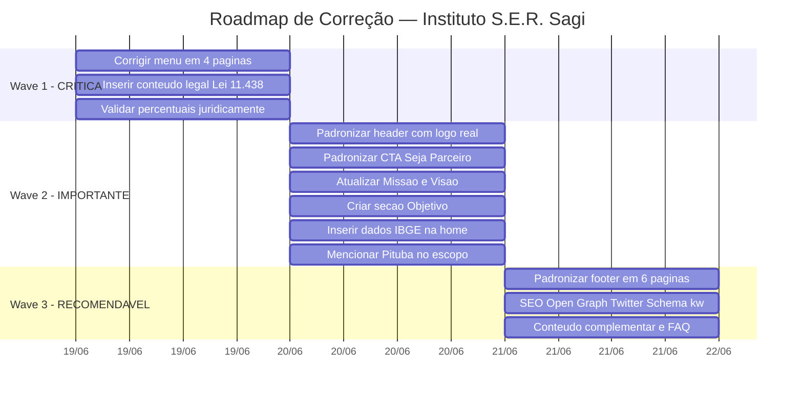
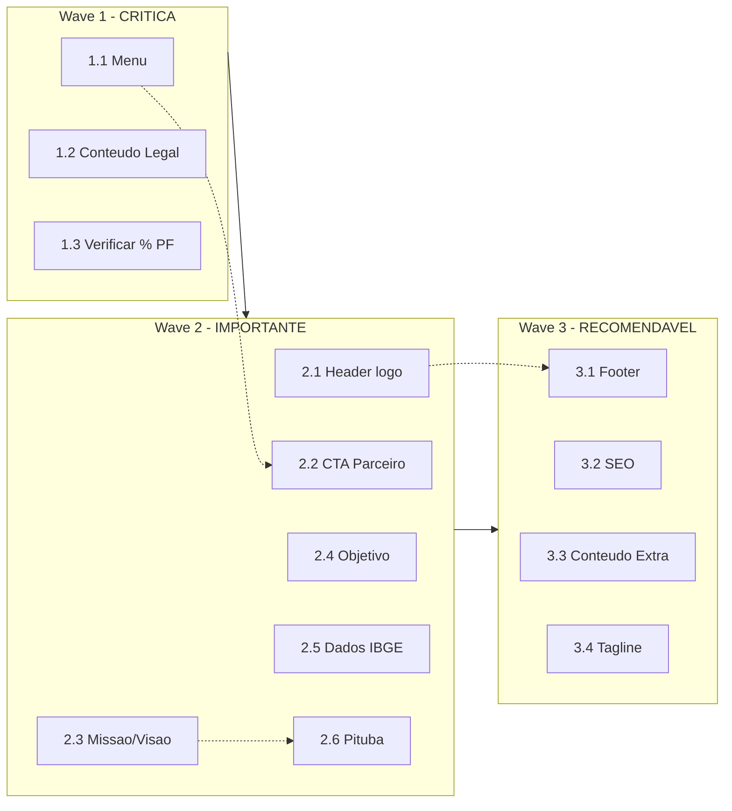

# Roadmap de Implementação — Correção de Conformidade

**Projeto:** Instituto S.E.R. Sagi — Site Institucional  
**Versão:** 2.0  
**Data:** 19/06/2026  
**Arquiteto:** Agente ARCHITECT  
**Origem:** [`briefing.md`](briefing.md) → [`requisitos.md`](requisitos.md) → [`escopo.md`](escopo.md)

---

## 1. Visão Geral do Roadmap

O roadmap está estruturado em **3 ondas (waves)** de implementação, organizadas por criticidade e dependências. Cada onda é autocontida e pode ser validada independentemente antes de prosseguir para a próxima.

---

## 2. Wave 1 — Correções Críticas 🔴

**Objetivo:** Eliminar riscos que comprometem a credibilidade institucional e a efetividade da captação.

**Meta de conformidade:** 72% → 88%

### Task 1.1 — Corrigir Menu de Navegação (RF01)

| Campo | Valor |
|-------|-------|
| **Arquivos:** | [`quem-somos.html`](../quem-somos.html), [`acoes.html`](../acoes.html), [`como-ajudar.html`](../como-ajudar.html), [`contato.html`](../contato.html) |
| **IDs escopo:** | B01, C01, D01, G01 |
| **O que fazer:** | Em cada arquivo, adicionar `<a href="lei-incentivo.html" data-page-link class="text-sm font-medium hover:text-ocean">Lei de Incentivo</a>` entre "Como Ajudar" e "Transparência" no menu desktop E no menu mobile |
| **Validação:** | Abrir cada página no navegador, verificar 7 links no menu e 7 links no menu mobile |

### Task 1.2 — Inserir Conteúdo Legal da Lei de Incentivo (RF05)

| Campo | Valor |
|-------|-------|
| **Arquivos:** | [`lei-incentivo.html`](../lei-incentivo.html), [`como-ajudar.html`](../como-ajudar.html) |
| **IDs escopo:** | D04, E02, E03, E04 |
| **O que fazer:** | 1. Em [`lei-incentivo.html`](../lei-incentivo.html), na seção "Quem pode apoiar", inserir: número da lei "Lei nº 11.438/2006", percentual empresas "até 2% do IR devido", percentual PF "até 6% do IR devido". 2. Em [`como-ajudar.html`](../como-ajudar.html), na seção de parceria empresarial, incluir referência ao número da lei e percentuais. |
| **Validação:** | Verificar que o número da lei e percentuais estão visíveis e corretos nas duas páginas |

### Task 1.3 — Verificar Percentual de Pessoa Física (RF05 / RN04)

| Campo | Valor |
|-------|-------|
| **Arquivos:** | [`lei-incentivo.html`](../lei-incentivo.html) |
| **IDs escopo:** | E04 |
| **O que fazer:** | O PDF menciona 7%, a lei estabelece 6%. Inserir "6%" (texto legal) com nota de rodapé informando que o PDF original menciona 7% e que o valor deve ser confirmado pelo contador do Instituto antes da publicação final. |
| **Validação:** | Texto reflete o valor legal vigente com ressalva documentada |

---

## 3. Wave 2 — Correções Importantes 🟡

**Objetivo:** Alinhar identidade visual, conteúdo institucional e comunicação de impacto.

**Meta de conformidade:** 88% → 96%

### Task 2.1 — Padronizar Header com Logo Real (RF02)

| Campo | Valor |
|-------|-------|
| **Arquivos:** | [`quem-somos.html`](../quem-somos.html), [`acoes.html`](../acoes.html), [`como-ajudar.html`](../como-ajudar.html), [`lei-incentivo.html`](../lei-incentivo.html), [`transparencia.html`](../transparencia.html), [`contato.html`](../contato.html) |
| **IDs escopo:** | B02, C02, D02, E01, F01, G02 |
| **O que fazer:** | Em cada arquivo, substituir o bloco `
<i class="fa-solid fa-owl text-xl"></i>

Instituto
<h1 class="text-lg...">S.E.R. Sagi</h1>
` por `` (ver código de referência no [`escopo.md`](escopo.md) seção 3.1) |
| **Validação:** | Abrir cada página e verificar que o header exibe o logotipo real, idêntico ao da home |

### Task 2.2 — Padronizar CTA "Seja Parceiro" (RF03)

| Campo | Valor |
|-------|-------|
| **Arquivos:** | [`quem-somos.html`](../quem-somos.html), [`acoes.html`](../acoes.html), [`como-ajudar.html`](../como-ajudar.html) |
| **IDs escopo:** | B03, C03, D03 |
| **O que fazer:** | Alterar `href="como-ajudar.html#parcerias"` para `href="lei-incentivo.html"` no botão "Seja Parceiro" do header. **Exceção:** [`lei-incentivo.html`](../lei-incentivo.html) mantém `#formulario-incentivo` (já está correto). |
| **Validação:** | Clicar em "Seja Parceiro" no header de cada página e verificar que leva a [`lei-incentivo.html`](../lei-incentivo.html) |

### Task 2.3 — Atualizar Missão e Visão (RF07)

| Campo | Valor |
|-------|-------|
| **Arquivos:** | [`quem-somos.html`](../quem-somos.html) |
| **IDs escopo:** | B04, B05 |
| **O que fazer:** | 1. **Missão** (linha ~36): substituir texto atual por "Promover o desenvolvimento humano e social de crianças, adolescentes e da comunidade do Sagi e regiões adjacentes, por meio do esporte, da saúde, da educação, da cultura e da preservação ambiental, fortalecendo valores como cidadania, inclusão e bem-estar." 2. **Visão** (linha ~37): substituir texto atual por "Ser referência regional em transformação social, reconhecido pelo impacto positivo na qualidade de vida, na valorização cultural e na proteção do meio ambiente, contribuindo para uma comunidade mais saudável, consciente e sustentável." |
| **Validação:** | Comparar texto lado a lado com PDF oficial |

### Task 2.4 — Criar Seção "Objetivo" (RF08)

| Campo | Valor |
|-------|-------|
| **Arquivos:** | [`quem-somos.html`](../quem-somos.html) |
| **IDs escopo:** | B06 |
| **O que fazer:** | Ao lado dos cards de Missão e Visão (ou abaixo deles, adaptando o grid), criar um card com título "Objetivo" e o texto: "Oferecer ações e projetos que incentivem hábitos saudáveis, a prática esportiva, o cuidado com a saúde, a valorização das origens culturais e a preservação da natureza, ampliando oportunidades e fortalecendo vínculos sociais." Se o grid atual é `md:grid-cols-3`, considerar `md:grid-cols-4` ou reorganizar como 2x2. |
| **Validação:** | Seção Objetivo visível em Quem Somos com texto oficial |

### Task 2.5 — Inserir Dados Demográficos IBGE (RF06)

| Campo | Valor |
|-------|-------|
| **Arquivos:** | [`index.html`](../index.html) |
| **IDs escopo:** | A02 |
| **O que fazer:** | Criar nova seção na home (após "Impacto em números" ou em "Quem Somos") com cards ou tabela exibindo: População Baía Formosa (9.115), distribuição etária (~24% 0-14, ~64% 15-59, ~12% 60+), comunidade Sagi (900-1000 moradores, ~230 crianças), comunidade Pituba (400-550 moradores, ~120-150 crianças). Incluir fonte: "IBGE, estimativa 2025". |
| **Validação:** | Dados visíveis, formatados e com fonte citada |

### Task 2.6 — Mencionar Pituba no Escopo de Atuação (RF09)

| Campo | Valor |
|-------|-------|
| **Arquivos:** | [`index.html`](../index.html), [`quem-somos.html`](../quem-somos.html) |
| **IDs escopo:** | A03, B07 |
| **O que fazer:** | Em [`index.html`](../index.html): ajustar texto do hero ou seção "Por que apoiar" para mencionar "Sagi e regiões adjacentes (incluindo Pituba)". Em [`quem-somos.html`](../quem-somos.html): já coberto pela nova missão (Task 2.3), mas reforçar na seção de origem. |
| **Validação:** | "Pituba" aparece em pelo menos 2 páginas |

---

## 4. Wave 3 — Melhorias Recomendáveis 🟢

**Objetivo:** Excelência em SEO, consistência visual completa e conteúdo complementar.

**Meta de conformidade:** 96% → 99%+

### Task 3.1 — Padronizar Footer (RF04)

| Campo | Valor |
|-------|-------|
| **Arquivos:** | [`quem-somos.html`](../quem-somos.html), [`acoes.html`](../acoes.html), [`como-ajudar.html`](../como-ajudar.html), [`lei-incentivo.html`](../lei-incentivo.html), [`transparencia.html`](../transparencia.html), [`contato.html`](../contato.html) |
| **IDs escopo:** | B10, C06, D05, E06, F02, G05 |
| **O que fazer:** | Substituir o footer simplificado de cada página pelo footer padrão de 3 colunas definido no [`escopo.md`](escopo.md) seção 3.2 |
| **Validação:** | Footer visualmente idêntico em todas as páginas |

### Task 3.2 — SEO: Open Graph, Twitter Cards, Schema.org e Meta Keywords (RF14)

| Campo | Valor |
|-------|-------|
| **Arquivos:** | Todos os 7 arquivos HTML |
| **IDs escopo:** | A04, B11, C07, D06, E07, F03, G06 |
| **O que fazer:** | 1. Adicionar bloco Open Graph + Twitter Cards em todas as páginas (template no [`escopo.md`](escopo.md) seção 3.3). 2. Adicionar `<meta name="keywords">` específico por página. 3. Adicionar `<meta name="theme-color" content="#0f5c73">` onde ausente. 4. Na [`index.html`](../index.html), adicionar `<script type="application/ld+json">` com Schema.org `NGO` (template no [`escopo.md`](escopo.md) seção 3.3). |
| **Validação:** | Usar Facebook Sharing Debugger e Twitter Card Validator (após deploy) |

### Task 3.3 — Conteúdo Complementar (RF10, RF11, RF12, RF13, RF15)

| Campo | Valor |
|-------|-------|
| **Arquivos:** | [`index.html`](../index.html), [`quem-somos.html`](../quem-somos.html), [`acoes.html`](../acoes.html), [`contato.html`](../contato.html) |
| **IDs escopo:** | A01, B08, B09, C04, C05, G04 |
| **O que fazer:** | 1. **RF10** — Trocar "origens locais" por "origens indígenas" em [`index.html`](../index.html) e [`quem-somos.html`](../quem-somos.html). 2. **RF11** — Adicionar história da criação do logo em [`quem-somos.html`](../quem-somos.html). 3. **RF12** — Adicionar "a arte suave" na descrição do Jiu-Jitsu em [`acoes.html`](../acoes.html). 4. **RF13** — Detalhar ações solidárias com menção a aniversários e convivência. 5. **RF15** — Criar seção FAQ em [`contato.html`](../contato.html) com 5+ perguntas e respostas. |
| **Validação:** | Cada alteração textual verificada individualmente |

### Task 3.4 — Tagline do PDF (RF05 complementar)

| Campo | Valor |
|-------|-------|
| **Arquivos:** | [`lei-incentivo.html`](../lei-incentivo.html) |
| **IDs escopo:** | E05 |
| **O que fazer:** | Inserir tagline "Invista, transforme e gere valor para a sociedade e para sua Empresa" em posição de destaque (hero ou seção final) |
| **Validação:** | Tagline visível na página de Lei de Incentivo |

---

## 5. Resumo de Tarefas por Onda

### Wave 1 — 🔴 CRÍTICA (3 tarefas, 4 arquivos)

| Task | Descrição | Arquivos |
|------|-----------|----------|
| 1.1 | Corrigir menu (adicionar Lei de Incentivo) | 4 arquivos |
| 1.2 | Inserir conteúdo legal (lei + percentuais) | 2 arquivos |
| 1.3 | Verificar % PF (6% ou 7%) | 1 arquivo |

**Checkpoint:** Navegação consistente e informações legais completas. Site publicável.

---

### Wave 2 — 🟡 IMPORTANTE (6 tarefas, 7 arquivos)

| Task | Descrição | Arquivos |
|------|-----------|----------|
| 2.1 | Header com logo real | 6 arquivos |
| 2.2 | CTA "Seja Parceiro" padronizado | 3 arquivos |
| 2.3 | Atualizar Missão e Visão | 1 arquivo |
| 2.4 | Criar seção Objetivo | 1 arquivo |
| 2.5 | Dados IBGE na home | 1 arquivo |
| 2.6 | Mencionar Pituba | 2 arquivos |

**Checkpoint:** Identidade visual uniforme, conteúdo institucional alinhado ao PDF, dados demográficos presentes.

---

### Wave 3 — 🟢 RECOMENDÁVEL (4 tarefas, 7 arquivos)

| Task | Descrição | Arquivos |
|------|-----------|----------|
| 3.1 | Footer padronizado | 6 arquivos |
| 3.2 | SEO completo (OG, Twitter, Schema) | 7 arquivos |
| 3.3 | Conteúdo complementar (indígena, logo, arte suave, FAQ) | 4 arquivos |
| 3.4 | Tagline do PDF | 1 arquivo |

**Checkpoint:** Site completo, SEO otimizado, conteúdo enriquecido. Conformidade acima de 99%.

---

## 6. Diagrama de Dependências

> Legenda: Setas sólidas indicam dependência de onda. Setas pontilhadas indicam dependências lógicas entre tasks.

---

## 7. Ordem de Execução Recomendada para CODE

Para o agente CODE, recomenda-se processar as alterações **por arquivo** e não por task, para minimizar idas e vindas. A ordem ótima:

| Ordem | Arquivo | Waves envolvidas | Tasks |
|-------|---------|-----------------|-------|
| 1º | [`lei-incentivo.html`](../lei-incentivo.html) | W1+W2+W3 | 1.2, 1.3, 2.1, 3.1, 3.2, 3.4 |
| 2º | [`quem-somos.html`](../quem-somos.html) | W1+W2+W3 | 1.1, 2.1, 2.2, 2.3, 2.4, 2.6, 3.1, 3.2, 3.3 |
| 3º | [`acoes.html`](../acoes.html) | W1+W2+W3 | 1.1, 2.1, 2.2, 3.1, 3.2, 3.3 |
| 4º | [`como-ajudar.html`](../como-ajudar.html) | W1+W2+W3 | 1.1, 1.2, 2.1, 2.2, 3.1, 3.2 |
| 5º | [`contato.html`](../contato.html) | W1+W2+W3 | 1.1, 2.1, 2.2, 3.1, 3.2, 3.3 |
| 6º | [`transparencia.html`](../transparencia.html) | W2+W3 | 2.1, 3.1, 3.2 |
| 7º | [`index.html`](../index.html) | W2+W3 | 2.5, 2.6, 3.2, 3.3 |

---

## 8. Handoff para ORCHESTRATOR

Este roadmap fornece ao ORCHESTRATOR:

1. **Estrutura de ondas** com objetivos e metas de conformidade mensuráveis
2. **Tasks atômicas** com arquivo(s) alvo, IDs de escopo e instruções precisas
3. **Critérios de validação** por task
4. **Diagrama de dependências** (Mermaid)
5. **Ordem de execução por arquivo** para eficiência do CODE
6. **Checkpoints** entre ondas para validação antes de prosseguir

**Arquivos gerados pelo ARCHITECT:**
- ✅ [`docs/briefing.md`](briefing.md) — (origem ASK)
- ✅ [`docs/requisitos.md`](requisitos.md) — 15 requisitos funcionais + 7 não funcionais
- ✅ [`docs/escopo.md`](escopo.md) — 44 alterações mapeadas + componentes de referência
- ✅ [`docs/roadmap.md`](roadmap.md) — 3 ondas, 13 tasks, ordem de execução

**Próximo agente:** ORCHESTRATOR — Gerar `plans/plan.md` com tasks detalhadas para o CODE.
